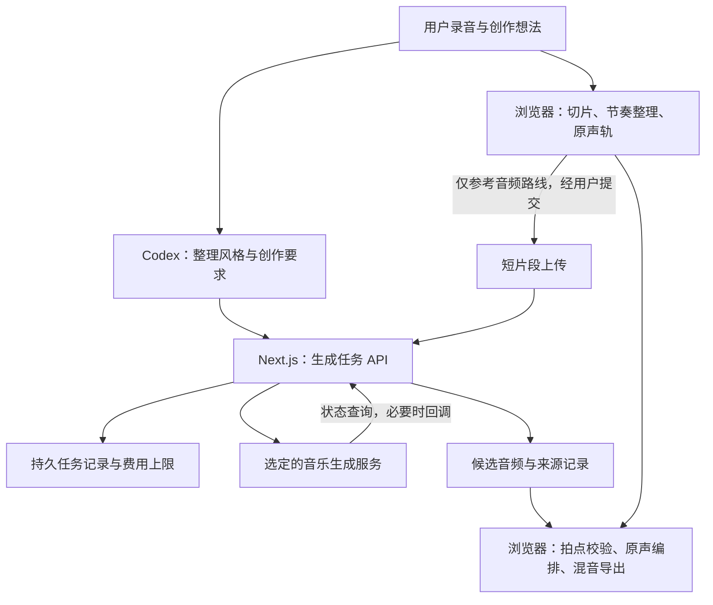

# Suno 接入调研与实施方案

调研日期：2026-10-06～2026-10-07。对象：MelodyMate 当前两分钟工作台。状态：设计建议，未登录服务商、未充值、未上传录音、未实际生成或验证音质。

2026-10-07 落地更新：用户要求先完成开发、后配置 Key。本期实现“独立文字伴奏 + 本地真实原声”，使用 Kie 新版 Create Task / Record Info；不包含上传、Cover、Extend、分轨及下述 API 草案中的上传/回调接口。加入浏览器工程保存、服务端任务/音频持久化、固定拍速估测与手动校准、立体声导出。当前未通过真实账号联调，不能将下文实验假设视为已验证效果。实际范围与操作见 [开发计划](./Suno开发计划.md)、[测试与开通指南](./Suno测试与开通指南.md)。

免费测试补充：[Kie.ai 首页](https://kie.ai/)明确介绍新用户 80 credits，但尚未确认赠额是否适用于该账号的 Suno Generate；[Suno 网页每日 50 credits](https://help.suno.com/en/articles/2410049) 不等于 API 额度。官方 Platform 的免费 API 配额未获公开确认。无 Key 可先使用有权取得的本地伴奏验收，不能保证无需付费即可调用生成。

## 1. 建议与产品目标

建议试用专业音乐生成模型承担声音生成，GPT/Codex 继续负责创作引导与需求整理。当前 GPT/Codex 输出的是编曲参数，实际声音来自浏览器采样与合成引擎；当前听感不足不能全部归因于 GPT。

**产品主路线建议：Suno 生成伴奏，MelodyMate 保留并编排用户的真实原声轨。先用小规模实验验证，再接入正式流程。** 同时比较“原声短片段作为参考，生成完整作品”的路线；若后者听感更好但原声难以辨认，标注为生成候选，不能宣称原声原样贯穿作品。

本轮默认目标为至少 120 秒、有发展和自然结尾的器乐作品，钢琴为首个伴奏方向。人声演唱、歌词、声音克隆不进入第一期。接受两分多钟，不追求机械地精确到 120 秒。

我们的差异应落在：指导普通人录制生活声音、把不准的录音变成可用节奏、让原声可辨且可独立编辑、解释它如何参与作品。仅增加一个文字生成歌曲按钮，无法体现这些价值。

## 2. 调研事实与证据边界

| 问题 | 已核实的信息 | 对本项目的影响 |
| --- | --- | --- |
| 是否存在官方 API？ | [Suno Platform](https://platform.suno.com/) 已公开音乐生成 API 登录入口，介绍 REST 原创歌曲、Cover、Mashup。 | 不能再笼统说“没有官方 API”。匿名页面不能确认账号资格、完整端点、价格及具体输入限制，优先取得官方账号文档。 |
| 能否生成两分钟？ | 官方网页产品的 v6 系列单次支持最长 8 分钟。[时长说明](https://help.suno.com/en/articles/13924929) | 能力上值得验证，但网页产品上限不等于 API 配额，也不保证每次输出满足目标时长。 |
| 应使用哪个版本？ | 2026-09-09 的官方 FAQ 介绍 v6 系列及旧模型退役。[v6 FAQ](https://help.suno.com/en/articles/13924481) | 不照旧博客写死 V4.5/V5；最终使用所选账号实际支持的模型与接口版本。 |
| 能否上传声音再创作？ | 官方有 Upload、Extend、Cover 等工作流；Cover 侧重保留旋律、改变风格。[上传示例](https://help.suno.com/en/articles/2477633)、[Cover 说明](https://help.suno.com/en/articles/2872257) | 可以测试把整理好的生活声音片段作为参考，但这不是原始采样保真承诺。旧帮助页的上传时长不作为当前 API 限制。 |
| 第三方有何能力？ | Kie.ai、sunoapi.org 公布了上传 Cover、Extend、补伴奏和分轨接口。[Kie 文档](https://docs.kie.ai/suno-api/upload-and-cover-audio)、[SunoAPI 文档](https://docs.sunoapi.org/suno-api/upload-and-cover-audio) | 两者按第三方评估，未核实 Suno 官方授权关系，不与官方 Platform 混称。 |
| 是否可指定时长？ | 两家当前 Cover 文档列出 `duration` 为 10～360 秒；Kie 默认 20 秒，适用于其列明的模型。 | 两分钟任务必须显式传目标值，建议实验先设 150 秒；仍校验实际音频，不把参数当成时长误差保证。 |
| 能否精准控制节奏/保留原声？ | 已查接口未给出精确 BPM、调性、原声波形保留的硬保证。`audio_weight` 是参考影响参数。 | 以下节拍与混音设计是工程方案，需要实测；权重 0.8 不代表保留 80% 的原声。 |

当前通用条款限制竞争性音乐生成产品，商业使用还与获准下载渠道有关。因此需要确认 **API 专属协议是否覆盖 MelodyMate 这种产品集成、终端用户上传与作品使用**；普通付费会员不能直接证明这些权限。不能反过来仅凭通用条款断言所有官方 API 集成都不可用。[Suno 服务条款](https://suno.com/terms)

原声上传会改变目前“录音只留在浏览器”的边界。上传者需要拥有相应权利；Suno 通用条款包含用于服务及模型改善的内容授权。界面应说明实际发送的片段、接收方及适用政策；API 如有不同数据条款，以确认后的协议为准。[Suno 服务条款](https://suno.com/terms)

比赛是否允许外部音乐模型、是否要求特定腾讯能力，目前未取得准确赛规，列为接入前待核对项。

## 3. 三条实现路线的取舍

| 路线 | 预期收益 | 主要问题 | 建议 |
| --- | --- | --- | --- |
| 文字直接生成整曲 | 最快比较专业模型的成曲效果 | 用户录音并未真正输入或参与，容易成为通用歌曲生成器 | 只作实验对照 |
| 8～16 秒原声节奏片段 → Cover/Extend | 原声节奏参与生成，较容易验证整体听感 | 模型可能重演音色；续写保留片头不能证明后续仍以原声为主；输出通常是完整混音 | 作为第二条实验路线，不能先承诺原声保真 |
| 独立生成伴奏 → 与本地原声编排混合 | 原声可辨、可独奏、可调音量和节奏，最符合产品核心 | 必须解决伴奏实际节拍与原声同步；单靠提示 BPM 不可靠 | 优先验证，作为产品主路线候选 |

`Add Instrumental` 值得补测，但不是直接解决全部问题的捷径。服务商将其定位为给上传音频补伴奏，典型输入包括人声或旋律；不能据此推断单次杯子敲击会自动扩展成两分钟、或返回不含原声的独立伴奏轨。[接口说明](https://docs.sunoapi.org/suno-api/add-instrumental)

第一期不依赖自动分轨。分离完整混音会增加等待和费用，也不能保证准确还原生活原声。[Kie 分轨说明](https://docs.kie.ai/suno-api/separate-vocals)

## 4. 推荐用户流程

1. **挑声音**：先提供敲桌、敲杯、摇动容器三类引导，解释它们适合节奏、点缀还是纹理。
2. **跟着录**：沿用当前倒数和节拍引导，录制两小节；自动检测敲击、归一化并对齐，让用户对比“录下的”和“整理后的”。
3. **说出感觉**：用户选择情绪、风格和主乐器，或自然语言描述。GPT/Codex 整理为创作要求；默认钢琴主导、稳定四拍、克制的其他打击乐。
4. **先听我的节奏**：浏览器播放短片段。选择参考音频路线时，明确展示即将上传的 8～16 秒内容；只有用户主动提交该生成任务才上传。
5. **生成伴奏/候选作品**：展示排队、生成、完成或失败状态。可能产生多个候选，按实际返回数量展示，不承诺固定两首和固定等待秒数。
6. **融合试听**：伴奏路线校验实际拍点后，重排原声切片；提供“只听原声 / 只听伴奏 / 一起听”，让用户听出自己的贡献。
7. **调整与导出**：原声音量、密度及出现段落可以本地修改；改变整段伴奏风格需要重新生成并说明会再次计费。完成后保留生成版本和导出文件。

若只获得完整生成混音，页面只能提供整体控制；不能继续展示仿佛能独立控制其中钢琴、贝斯、铺底的滑块。局部精确编辑只有在拥有对应真实音轨时才开放。

## 5. 原声与伴奏如何同步

这是新增音频工作的主要难点，不能用一次 API 调用掩盖。

- 初期要求稳定节拍、清楚起拍、钢琴为主，减少自由速度和复杂鼓组。原声优先使用无明显音高的短敲击，降低与生成和声冲突的概率。
- 提示里的 BPM 是目标；使用生成音频的实际拍点作为时间基准，再调度原声切片。输入整理时的节奏格子保存相对拍位，输出时映射到实际拍点。
- PoC 允许开发者确认首拍、速度及段落拍点。完整自动检测不预先算作“两天内必然完成”。若节拍明显漂移或拍点不可靠，候选不能自动进入融合导出。
- 不通过改变整个伴奏的 `playbackRate` 简单凑速度，以免同时改变音高；本期不开发通用高质量时间伸缩。
- 在开头、中段、末尾试听是否跑拍，检查原声是否被钢琴或模型自带打击乐掩盖。只在片头播放原声，不满足“原声是主角”。
- 用户认为素材有明显音高，或试听发现与伴奏冲突时，提示改选短敲击或本地可控伴奏。当前引擎没有自动音高与调性置信度判断，本期不将它作为已有能力。

## 6. 接入架构：保留单体，增加异步生成与音频资产

首版只实现一个已确认可用的服务商，不建设多服务商路由平台。Key 留在服务端，本机演示使用环境变量。浏览器拿到本项目的任务 ID，不直接持有服务商 Key。

本机最小方案：Next.js Node 进程 + 原生 `fetch` + 本地私有目录保存任务 JSON 和获准下载的结果音频，限制一个生成任务同时提交，原子保存任务状态。刷新后可查询任务；原声 Blob 和工程快照放浏览器 IndexedDB，避免只恢复结果却丢失可编辑原声。公开部署再换持久数据库和对象存储，不能假设 Serverless 本地文件持久或进程内额度全局有效。

浏览器在提交前保存幂等键及工程快照，服务端在调用上游前保存本地任务和预算预占。同键重试返回原任务，覆盖“已收单但浏览器没收到 jobId”的情况；拿到 jobId 后也持久化关联。本机最小方案不设常驻查询进程：关闭页面后上游可继续生成，但本地不会保证自动保存结果；重新打开时恢复查询与下载。恢复仅在上游结果仍可获取时成立，过期应说明原因，不能自动重新付费生成。公开服务若要求无人打开页面也能可靠保存结果，需要增加持久任务执行机制。

如果参考音频接口只接受 URL，浏览器 `blob:` 地址和 `127.0.0.1` 都不能交给云端抓取。使用确认可用的服务商文件上传接口，或带有效期的对象存储下载地址；第一期不同时接两套上传方案。上传地址须覆盖排队和读取时间。

### 项目 API 草案（不是 Suno 官方端点）

| API | 请求与结果 | 关键约束 |
| --- | --- | --- |
| `POST /api/music/uploads` | 参考片段 → `assetId` | 仅参考音频路线使用；校验大小/类型，记录上传接收方 |
| `POST /api/music/jobs` | 工程快照、创作要求、可选 `assetId`、幂等键 → `202 + jobId` | 成功提交不代表生成完成；服务端预算检查及重复请求去重 |
| `GET /api/music/jobs/:id` | → 状态、候选、失败原因 | 查询上游并保存进度；浏览器刷新可恢复，访问限定本人的任务 |
| `GET /api/music/assets/:id` | → 已保存的音频 | 同源播放/导出；不接收任意外部下载 URL |
| `POST /api/music/callback` | 服务商通知 | 仅所选接口需要时实现；校验来源、幂等处理，并回查上游确认状态 |

默认采用轮询，间隔数秒、超时逐步放缓；不在一个 HTTP 请求里等整首歌生成，也不依赖返回响应后仍会存活的后台 Promise。若服务商要求回调地址，本机需另外有可达的 HTTPS 接收端；不能只把 localhost 填进参数。没有签名机制时，通知只作触发查询的信号。

保留三类状态，避免把混音文件塞入现有乐谱：

| 数据对象 | 最小字段 |
| --- | --- |
| `MusicBrief` | 情绪、风格、乐器、目标时长、是否纯音乐、参考节奏信息 |
| `GenerationJob` | 本地/上游任务 ID、服务商及模型、操作类型、工程 revision、原声/片段 hash、请求快照、幂等键、状态、时间、费用记录 |
| `GeneratedAsset` | 候选 ID、任务 ID、来源及授权记录、实际时长/采样率/声道、保存位置、拍点与置信度、原声编排版本 |

状态建议为 `submitting → queued → generating → saving → ready`，另有 `failed`、`submit_unknown`。提交超时且不知上游是否收单时先核对，不能自动重复付费提交；`submit_unknown` 继续占用预估预算，直到账单或任务状态确认。用户停止等待不等于上游取消或退款。旧 revision 的结果保留为候选，不覆盖当前工程。

云端生成不具备当前本地渲染的确定性；重放必须读取已保存音频，不能靠同样提示词再次生成。下载仅使用协议允许的接口，保留原始文件及来源信息；混音导出另存派生文件。

## 7. 现有模块如何复用

| 文件/能力 | 处理方式 |
| --- | --- |
| `components/GuidedRecorder.tsx`、`lib/recording-analysis.ts` | 保留录音引导、敲击分析、响度处理和切片节奏重排 |
| `lib/site-tools.ts`、`components/CodexHandoff.tsx` | 保留本机 Codex 的需求整理；音乐任务提交仍由应用校验，不让模型持 Key 或任意执行接口 |
| `lib/song-types.ts`、`lib/use-song-studio.ts` | 保留本地 `SongPlan`、revision 和撤销；另增生成任务与资产状态 |
| `lib/song-render.ts` | 保留原声调度和本地备用编曲；新增独立伴奏音频混合，避免重复叠加原有钢琴 |
| `lib/audio-playback.ts`、`lib/wav.ts` | 复用播放启动机制；云端结果保留实际声道，融合导出需检查当前单声道实现，避免无意降质 |
| `components/SongStudio.tsx` | 增加生成状态、候选试听、原声与伴奏对比、重生成费用提示 |
| `app/api/suggest/route.ts` | 保留旧参数助手，不复用其短超时请求承担长音频生成 |

当前素材导入有 12 秒/10 MiB 限制，不能把两分钟生成结果走现有原声导入入口。外部伴奏应走独立资产解码路径，并单独控制内存和文件大小。

## 8. 服务商选择与费用

**优先顺序：官方 Platform → 核实用途授权及能力后的一个第三方试验 → 未获得可用接口时仅做官方网页能力评估。** 网页手动生成验证只能证明声音效果，不能标成已经完成 API 接入。

第三方初选可优先核对 Kie：公开接口与任务价格较完整；这不是对其授权、稳定性或音质的背书。sunoapi.org 作为备选，本轮未核实其生成任务单价。两家运营条款都应独立审阅。[Kie 条款](https://kie.ai/terms-of-use)、[SunoAPI 条款](https://sunoapi.org/terms-of-use)

Kie 当前页面显示 Cover、Extend、Add Instrumental 为 12 credits/任务，主页音乐报价为 $0.06/请求。按该公开报价估算，12 次生成约 $0.72，未含分轨、续写、失败扣费、存储等，也不是最低充值金额或官方 API 价格。实际收费先用账号确认。[任务价格](https://kie.ai/suno-api)、[美元报价](https://kie.ai/)

集成时需注意这些已查到的文档差异：

- Kie 新文档采用 `/api/v1/jobs/createTask` 和 `input` 参数；查询走 `/api/v1/jobs/recordInfo`。旧接口仍有单独文档。示例里仍能看到旧模型与互相冲突的字段，不能原样复制。[Cover 文档](https://docs.kie.ai/suno-api/upload-and-cover-audio)、[任务查询](https://docs.kie.ai/market/common/get-task-detail)
- SunoAPI 的 Cover 文档将回调地址列为必填，同时允许查询状态。选择轮询不代表可省略必填参数。[Cover 文档](https://docs.sunoapi.org/suno-api/upload-and-cover-audio)
- 服务商页面对文件保留有 14/15 天不同表述，Kie 通用查询页另称结果 URL 通常 24 小时过期。文件保留和 URL 有效期应分别处理，成功后及时通过获准渠道保存。[Kie 总则](https://docs.kie.ai/)、[查询说明](https://docs.kie.ai/market/common/get-task-detail)

## 9. 开发顺序与验收

先确认账户接口、允许用途和测试预算，再开始以下实际调用。本轮只提出实验，不消耗额度。

| 阶段 | 范围 | 通过条件 |
| --- | --- | --- |
| 半天：声音验证 | 同一段真实敲桌声，文字整曲、原声片段 Cover、独立钢琴伴奏各测试两次，共六次；必要时再补杯声/沙沙声，首轮建议最多十二次 | 至少一条符合原声核心的路线得到可接受听感；完整试听，不只听前十秒 |
| 第一天：任务链路 | 固定一家服务商与模型，提交/查询/保存、费用上限、重复提交防护、失败显示 | 刷新恢复；旧任务不覆盖；提交结果不确定时不重复扣费 |
| 第二天：工作台串联 | 录音→生成→试听→独立原声混合→导出；节拍校验先限定稳定节奏 | 原声可独奏且在混合中可辨；实际时长≥120秒、自然结尾；不靠循环补齐或硬切凑时长 |
| 最后至少半天：彩排与复测 | 当前浏览器、比赛网络、麦克风、音频下载、额度耗尽与服务不可用 | 可演示真实端到端流程；失败可回到原有本地创作路径 |

以上估算以账号和接口可用为前提。若仍要求严格两天交付，应缩为声音验证与最小生成候选演示；自动处理任意伴奏的节拍漂移、多音轨编辑和稳定公开部署另行排期。

最小实验记录：每次的输入片段、模型/参数、实际扣费、等待时长、成功/失败、输出时长，以及开头/中段/结尾的原声辨识度、跑拍与听感。请至少两人分别比较原声和成品，1～5 分评分；建议原声辨识与整体听感均达到 4 分才进入正式候选。小样本只用于选路线，不宣称统计成功率。

若 Cover 成品抹去了原声，保留为创作参考；若独立伴奏无法可靠对齐，不自动融合；若两条都未过门槛，不将“接上 Suno”视为需求完成。下一步应依据试听结果调整模型或伴奏策略。

本次仅新增方案文档，未修改应用、安装依赖或实施付费调用。下一步所需信息是官方/第三方账号可用能力、确认的集成授权、测试预算及比赛对外部模型的要求；API Key 通过本机环境变量配置，不发在聊天或提交进 Git。
