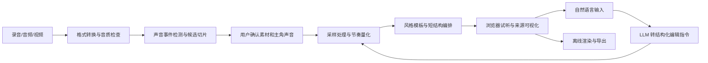

# 可行性分析报告

- 版本：v1.0
- 日期：2026-09-26
- 分析对象：面向普通用户的生活声音采样创作产品
- 核心命题：让用户用自己录下的生活声音，亲手完成一段可听、可改、可分享的短音乐

## 1. 执行结论

产品方向成立，并且适合音乐黑客松，但完整愿景与比赛 MVP 的可行性差异很大。

如果产品试图同时实现任意视频声源分离、自由音乐生成、完整歌曲结构和开放式自然语言编辑，整体可行性较低，风险主要集中在声音分离质量、生成结果稳定性和局部编辑不可控。

如果把第一版收缩为“确定性采样编排 + AI 交互”，让用户录制 1～3 个相对清晰的声音，由系统完成切片、量化、模板编排，并把自然语言限制为六类可执行操作，则黑客松 MVP 具有较高可行性。

综合判断：

| 方案 | 可行性 | 结论 |
|---|---:|---|
| 按完整产品愿景一次实现 | 4/10 | 范围过大，不适合黑客松 |
| 收缩后的比赛 MVP | 8/10 | 推荐实施 |
| 作为长期消费产品继续发展 | 7/10 | 需要验证留存、版权与生成成本 |

推荐的一句话定位：

> 用 1～3 个生活声音，在 3 分钟内亲手做出一段能听出声音来源、还能用自然语言修改的音乐。

## 2. 分析前提

参赛团队已确认为 2 人。开发周期和比赛指定技术栈尚未明确，本报告基于以下假设：

- 团队固定为 2 人。
- 可集中开发 5～10 天。
- 交付形态为 Web 或桌面浏览器 Demo。
- 可以使用现成的大语言模型、音频处理库和云端推理服务。
- 比赛目标优先级为创意表达、完整体验、现场稳定性和技术说明。
- 第一版只处理用户有权使用的自录素材。

双人团队需要避免前后端、算法和产品界面同时铺开。建议一人负责产品流程、前端交互和演示整合，另一人负责音频处理、采样编排和自然语言指令转换，两人共同完成模板调音和现场演练。

如果实际时间少于 5 天，应继续删减视频上传、AI 声音命名、视频合成和版本收藏，只保留音频录制、选片、三种模板、来源展示、六类修改及导出。

## 3. 用户价值可行性

### 3.1 问题真实存在

普通用户能够发现有趣的生活声音，却通常不具备以下能力：

- 从录音中找到适合采样的片段。
- 把声音切成稳定节奏。
- 判断声音适合做鼓点、装饰还是氛围。
- 使用专业效果器处理音色。
- 把“更松弛”“别那么吵”转换成音乐操作。

现有专业工具可以完成这些任务，但学习成本高；纯 AI 作歌工具降低了门槛，却容易让用户失去素材控制权和创作参与感。因此，“保留个人素材，同时降低制作门槛”具有明确价值。

### 3.2 最强使用场景

最适合第一版的场景不是泛化的“人人都来做音乐”，而是：

> 用户拍完一段日常或旅行视频，用现场的杯子声、脚步声、车门声或环境声，快速制作一段 15～25 秒专属配乐。

这一场景具备四个优势：

- 输入素材天然来自用户生活。
- 短音乐对专业制作质量的要求低于完整歌曲。
- 结果能直接用于 vlog、短视频或照片日记。
- “原声音到成品”的变化适合现场演示和社交分享。

### 3.3 用户价值风险

该需求具有较强的新鲜感，但使用频率尚未验证。用户可能愿意尝试一次，却未必持续创作。

长期产品需要验证三个指标：

- 用户是否会在第二个生活场景中再次使用。
- 用户是否愿意进行至少一次局部修改，而不是只听生成结果。
- 用户是否会导出或分享带有声音来源说明的作品。

## 4. 市场与差异化可行性

### 4.1 不能只讲“声音生成音乐”

“上传或录制声音，再生成一首歌”已经存在直接竞品。Suno 的 Sample 能力支持选择音频片段，并以 Chop、As-is、Blend 等方式带入新歌曲，也能选择是否保持原始音高和速度；其 Studio 已覆盖多轨、效果、Stem 分离和对话式操作。

因此，单纯强调“任意声音都能变成音乐”不足以构成比赛中的强差异。

### 4.2 可成立的差异

产品需要把差异集中在“可见、可控、可追溯”：

- 用户明确选择哪些生活声音进入作品。
- 用户指定一个主角声音，并能在成品中辨认它。
- 页面展示每个声音在何时出现、经过什么处理。
- 用户可以单独修改某个声音或段落。
- 未被指定的满意部分保持不变。
- 分享结果强调作品与原始生活场景的关系。

由此，产品竞争位置不是另一个 AI 作歌器，而是面向小白的生活声音共创工具。

### 4.3 与腾讯能力的匹配

腾讯体系已经具备音乐生成、音源分离、降噪、风格转换、视频配乐、K 歌音频处理和内容分发能力。本产品可以在现有技术能力上增加一个面向普通用户的体验层：

- 上游承接腾讯多媒体实验室或腾讯云的音频处理能力。
- 中间形成生活声音采样、编排和自然语言修改流程。
- 下游可以与 QQ 音乐、全民 K 歌、未音及视频内容场景连接。

技术协同较强，但报告目前没有证据证明腾讯已有产品提供完全相同的用户工作流。相关产品调研见 [需求分析](./需求分析.md)。

## 5. 技术可行性

### 5.1 能力拆解

| 能力 | MVP 可行性 | 主要方案 | 主要风险 |
|---|---:|---|---|
| 录音和上传音频 | 高 | 浏览器录音、文件上传 | 浏览器权限与格式兼容 |
| 从视频提取音频 | 高 | FFmpeg 或云端转码 | 文件体积和处理时间 |
| 去静音、响度统一、轻量降噪 | 高 | 成熟 DSP 或云端接口 | 强降噪会破坏音色 |
| 发现明显声音事件 | 高 | 能量、onset 和间隔检测 | 连续环境声不易切片 |
| 判断节奏、装饰、氛围用途 | 中高 | 声学特征加规则 | 语义标签可能不准确 |
| 识别具体物体声音 | 中 | 音频分类模型 | 不应成为关键链路依赖 |
| 分离任意重叠生活声音 | 低到中 | 语言查询式声音分离模型 | 延迟、算力、残留噪声和稳定性 |
| 将敲击声做成节奏 | 高 | 切片、量化、循环、包络和滤波 | 素材攻击性不足时效果弱 |
| 将任意声音做成旋律 | 中 | 变调采样器、音高映射 | 非稳定音高素材容易失真 |
| 生成稳定短音乐 | 中高 | 固定段落和风格模板 | 模板数量少会产生重复感 |
| 开放式生成完整歌曲 | 低到中 | 生成模型或外部服务 | 时延、随机性和素材保真 |
| 自然语言局部修改 | 高 | LLM 转结构化操作 | 必须限制可执行指令集合 |
| 素材来源可视化 | 高 | 保存采样事件和轨道元数据 | 需要统一播放时间轴 |
| 版本对比和撤销 | 高 | 参数快照和非破坏性编辑 | 需要控制缓存体积 |
| 音频导出 | 高 | 离线渲染或服务端混音 | 不同浏览器编码支持 |

### 5.2 最关键的技术边界

“声音事件发现”和“任意声源分离”必须拆开处理。

- 声音事件发现：从录音中找出敲击、响动等边界清楚的片段，技术成熟，适合进入 MVP。
- 任意声源分离：从嘈杂视频中独立分出钥匙、脚步、说话和环境声，虽然已有 AudioSep 等语言查询式研究方案，但真实场景中的稳定性和响应时间仍有较高风险。

因此，第一版应鼓励用户分别录制声音。视频上传只负责提取音轨并寻找明显事件，不能把精确分离作为核心演示承诺。

### 5.3 推荐技术路线

推荐采用“确定性音频引擎 + AI 意图转换”的混合架构：

核心原则：

- 音乐播放和修改由可预测的参数驱动。
- 大语言模型只把自然语言转换为轨道、动作、幅度和段落等结构化字段。
- 生成模型可以补充背景氛围或伴奏，但不进入关键演示链路。
- 所有编辑均保存参数差异，从而实现解释、撤销和版本对比。

### 5.4 三种实现路线对比

| 路线 | 方法 | 优点 | 缺点 | 结论 |
|---|---|---|---|---|
| A. 采样编排型 | DSP、模板、采样器、受限自然语言编辑 | 稳定、可控、保留原声、适合现场演示 | 风格数量有限 | 强烈推荐 |
| B. 混合生成型 | 采样编排为主，生成模型补伴奏或氛围 | 音乐丰富度更高 | 时延和结果一致性下降 | 有余力再加入 |
| C. 端到端生成型 | 将音频和文本直接交给音乐生成模型 | 开发入口简单，偶尔有惊喜 | 素材可能被吞没、局部修改困难、无法保证演示 | 不推荐作为 MVP |

## 6. MVP 范围与工作量

### 6.1 必须完成的闭环

1. 录制或上传 1～3 段声音。
2. 推荐 3～6 个声音事件片段。
3. 用户确认片段和主角声音。
4. 选择轻快日常、夜晚松弛或节奏卡点。
5. 生成 15～25 秒短音乐。
6. 在时间轴上展示声音来源。
7. 支持音量、密度、进入段落、明亮度、混响、整体节奏六类修改。
8. 支持前后版本对比、撤销和音频导出。

### 6.2 建议排期

在 2 人、5～10 天的假设下，建议采用一条纵向闭环逐步加深，避免两人分别开发两个无法及时集成的子系统：

| 阶段 | 目标 | 完成标准 |
|---|---|---|
| 第 1 阶段 | 音频输入和切片 | 能录音、播放并手动或自动选出片段 |
| 第 2 阶段 | 采样播放引擎 | 三个样本能按稳定节拍循环和组合 |
| 第 3 阶段 | 三个风格模板 | 同一组素材可生成三个明显不同的版本 |
| 第 4 阶段 | 来源可视化 | 播放时能高亮当前生活声音 |
| 第 5 阶段 | 六类自然语言修改 | 指令可稳定映射到结构化参数 |
| 第 6 阶段 | 版本与导出 | 可以对比、撤销并导出最终音频 |
| 第 7 阶段 | Demo 打磨 | 固定素材和现场录制都能完成演示 |

如果开发时间不足，功能删减顺序为：视频重新合成、视频上传、声音名称识别、分享卡片、版本收藏。不能删掉主角声音、来源展示和局部修改，因为它们构成产品差异。

### 6.3 双人分工建议

| 参赛者 | 主责 | 需要共同确认的接口 |
|---|---|---|
| A：产品与前端 | 用户流程、录音上传、声音卡片、时间轴、版本对比、导出与路演 | 音频片段数据结构、编辑指令结构、播放状态 |
| B：音频与 AI | 切片、响度处理、采样播放、三种编排模板、自然语言到参数转换 | 音频文件格式、轨道参数、离线渲染结果 |

两人每天至少完成一次端到端集成。任何新增能力都必须先接入“录音—生成—修改—导出”主流程，再继续扩展。

## 7. 主要风险与应对

| 风险 | 影响 | 应对方案 |
|---|---|---|
| 原始录音太嘈杂 | 无法找到可用片段 | 引导分别录制；提供实时音量和噪声提示 |
| 自动切片选错 | 用户失去控制 | 推荐多个候选；允许试听、重选和改名 |
| 生成结果像素材拼贴 | 音乐完成度不足 | 用固定节拍、四段式结构和轻量伴奏兜底 |
| 伴奏盖住生活声音 | 核心价值消失 | 主角声音设置响度下限；提供原声保留强度 |
| 自然语言修改不可控 | 演示失败 | 只映射六类操作；修改前复述动作 |
| 依赖生成 API 导致超时 | 现场不可用 | 关键链路使用本地模板；准备缓存结果 |
| 与 Suno 等产品相似 | 创意得分下降 | 强调来源可视、逐轨控制、生活叙事和局部修改 |
| 用户只体验一次 | 长期留存不足 | 后续围绕视频配乐、声音日记和周期作品验证复用场景 |
| 素材版权不清 | 分享和商用风险 | MVP 限定用户自录或有权使用的素材 |

## 8. 比赛展示可行性

该产品具有较强的现场展示能力，因为输入和结果之间的变化容易被评委感知。

推荐演示脚本：

1. 现场敲杯子、摇钥匙、拉拉链。
2. 系统推荐三个声音片段。
3. 用户选择杯子为主角声音。
4. 输入「轻快的通勤 vlog，保留杯子原声」。
5. 播放第一版，并高亮三个声音的出现位置。
6. 输入「钥匙声太抢了，让它少一点，第二段再进入」。
7. 对比修改前后版本。
8. 导出作品，展示声音来源卡片。

演示需要准备两套输入：

- 现场实时录制，用于证明交互成立。
- 预先录好的稳定素材，用于现场环境过于嘈杂时兜底。

## 9. 验收与决策门槛

### 9.1 MVP 通过条件

- 三组不同生活声音均能完成输入、切片、编排、修改和导出闭环。
- 从用户点击生成到可以试听，模板路线下不超过 10 秒。
- 主角声音在成品中可以由用户辨认。
- 六类支持指令能够修改指定对象，并保持未指定部分基本不变。
- 页面能够准确高亮每个生活声音的出现位置。
- 在断开生成模型服务时，核心演示仍可完成。

### 9.2 应暂停扩展的信号

如果以下任一条件出现，应停止增加新功能，优先修复核心闭环：

- 需要依赖任意声源分离才能得到可用结果。
- 每次生成的音乐结构和音量差异过大，无法稳定演示。
- 局部修改实际触发整段重生成。
- 用户无法在成品中辨认自己的声音。
- 团队把主要时间用于专业编辑器界面，而不是素材到音乐的核心体验。

## 10. 综合结论

| 维度 | 评分 | 判断 |
|---|---:|---|
| 用户需求 | 4/5 | 需求明确，但长期使用频率需要验证 |
| 创意表达 | 4/5 | 生活素材和亲手参与有感染力 |
| 当前差异化 | 3/5 | 声音生成音乐已有竞品 |
| 收缩后差异化 | 4/5 | 来源可见、局部可控形成明显区隔 |
| MVP 技术可行性 | 4/5 | 使用成熟音频技术和模板可完成 |
| 完整愿景技术可行性 | 2.5/5 | 任意分离和开放编辑仍不稳定 |
| 腾讯能力匹配 | 4.5/5 | 能承接音乐、音频、视频和内容生态 |
| 现场展示效果 | 5/5 | 输入直观，前后变化明显 |

产品值得进入原型阶段，但实现策略必须坚持三条原则：

1. 先做好短音乐，不做完整歌曲。
2. 先保证生活声音可辨认，不追求无限生成能力。
3. 先让有限指令稳定生效，不承诺万能自然语言编辑。

第一版真正需要证明的不是“AI 能不能生成音乐”，而是：

> 普通用户是否会因为听见自己的生活声音被编进音乐，而产生“这是我做的”这种明确感受。

## 11. 参考资料

- [Suno Sample](https://suno.com/products/samples)
- [Suno 产品能力](https://suno.com/products)
- [Essentia 节拍和 BPM 检测](https://essentia.upf.edu/tutorial_rhythm_beatdetection.html)
- [Tone.js](https://tonejs.github.io/)
- [Meta AudioCraft / MusicGen](https://github.com/facebookresearch/audiocraft/blob/main/docs/MUSICGEN.md)
- [AudioSep](https://github.com/Audio-AGI/AudioSep)
- [腾讯多媒体实验室智能音乐](https://multimedia.tencent.com/zh/products/smart-music/)
- [项目内腾讯音乐 AI 能力调研](./需求分析.md)
