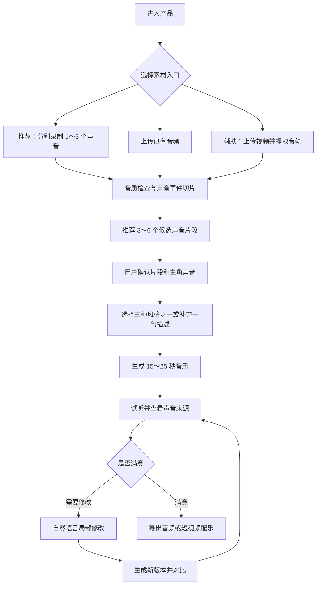

# 用户流程

## 1. 产品定位

产品核心体验是：让没有音乐制作经验的普通用户，用自己录下的生活声音，亲手做出一段能听出声音来源、可以继续修改的短音乐。

第一版的产品承诺是：

> 用 1～3 个生活声音，在 3 分钟内完成一段 15～25 秒的音乐，并能用自然语言修改指定声音或段落。

产品不要求用户理解采样、量化、BPM、轨道、混响等专业概念。系统负责完成声音切片、节奏对齐、音色处理和编排，用户负责选择素材、决定感觉和提出修改。

## 2. 第一版产品边界

### 第一版保证的能力

- 录制 1～3 段相对清晰的生活声音，或上传已有音频。
- 从素材中发现音量明显、边界清楚的声音片段。
- 由用户确认片段及其名称，并选择一个“主角声音”。
- 在三个固定风格方向中生成 15～25 秒短音乐。
- 展示每个生活声音在作品中的出现位置。
- 将自然语言转换成六类确定的局部修改。
- 保存版本、对比前后效果并导出音频。

### 第一版不承诺的能力

- 从任意嘈杂视频中精确分离所有物体声音。
- 根据任何声音稳定生成完整旋律或完整歌曲。
- 生成人声、歌词和完整主歌副歌结构。
- 理解没有边界的专业音乐编辑指令。
- 提供完整 DAW、多轨混音和母带能力。

上传视频保留为辅助入口：系统提取视频音轨并寻找清晰声音事件；如果多个声音严重重叠，则引导用户重新单独录制，不承诺完成任意声源分离。

## 3. 目标用户与核心场景

### 核心用户

- 喜欢拍摄日常、旅行、通勤或朋友聚会视频的普通用户。
- 对音乐创作感兴趣，但没有使用专业编曲软件经验的人。
- 希望作品保留自己的声音和生活痕迹，而不是只得到一首通用 AI 音乐的人。

### 第一核心场景

用户刚拍完一段日常或旅行视频，录下杯子、脚步、车门、钥匙或环境声，在几分钟内把这些声音做成一段适合短视频使用的专属配乐。

### 用户核心动机

- 我想把今天遇到的声音保存成一段音乐。
- 我想亲手参与，但不想学习复杂的音乐软件。
- 我想知道自己的声音在作品中被怎样使用。
- 我希望用日常语言修改结果，并且只改我不满意的部分。

## 4. 主流程概览

## 5. 第一次创作流程

### 5.1 进入产品

首页只传达一个动作：

> 录下身边的声音，把它做成音乐。

入口按优先级排列：

1. 主入口：「开始录声音」
2. 次入口：「上传音频」
3. 辅助入口：「从视频中找声音」

首页通过一个 10 秒示例展示“原声—处理后声音—完整音乐”，让用户在开始前理解产品效果。

### 5.2 录制或上传素材

推荐用户分别录制 1～3 个声音，每段录音持续 3～10 秒，例如：敲击杯子、摇动钥匙、拉动拉链、脚步、关门、自行车铃声或一小段稳定环境声。

录音页给出简单提示：

- 靠近声源。
- 每次尽量只录一种声音。
- 同一种声音可以连续做三次，方便系统挑选。

系统实时展示波形和录音质量，并用“清晰”“有背景噪声”“声音太小”等日常语言反馈。

### 5.3 音质检查与片段推荐

系统完成以下基础处理：

- 去除前后静音。
- 检测明显的声音起点。
- 统一响度并进行轻量降噪。
- 找出边界清晰、适合重复使用的片段。
- 判断片段更适合做节奏、装饰或氛围。

系统只需要推荐 3～6 个候选片段，不要求准确识别所有物体名称。名称识别不确定时使用中性标签，例如“声音 1”“清脆敲击”，并允许用户改名。

每张声音卡片包括原声试听、清理后试听、原始位置、推荐用途和使用开关。

### 5.4 确认素材和主角声音

用户选择 1～3 个声音进入作品，并指定其中一个为“主角声音”。

主角声音需要满足：

- 在成品中能够被清楚听见。
- 至少在两个段落中出现。
- 默认不过度改变其音色特征。

其他声音可以作为节奏、装饰或环境层。这个选择使用户明确参与创作，也为后续编排提供稳定约束。

### 5.5 选择音乐感觉

第一版只提供三个稳定方向：

- 轻快日常：适合生活记录和 vlog 结尾。
- 夜晚松弛：节奏较疏，空间感更明显。
- 节奏卡点：节拍突出，适合短视频剪辑。

用户可以额外输入一句描述，例如“轻松一点，但不要太可爱”或“像晚上骑车，留一点环境感”。系统将描述映射到已有风格参数，不承诺创造无限的新曲风。页面不展示 BPM、调性或压缩等专业设置。

### 5.6 生成音乐初稿

系统根据选定声音、主角声音和风格模板，生成一段 15～25 秒的器乐短音乐。

第一版采用“生活声音采样编排 + 轻量伴奏”的方式：

- 生活声音经过切片、节奏对齐和必要的音色处理。
- 模板决定作品的速度、段落、密度和基本伴奏。
- 伴奏只负责支撑结构，不能掩盖主角声音。
- 作品采用开头、进入、变化、结尾四段式短结构。

初稿验收条件：

- 用户能辨认出主角声音。
- 作品具有稳定节拍和明确结尾。
- 每个被选中的声音都至少出现一次。
- 生成后仍可进行局部修改，而不是只能整段重做。

### 5.7 试听与声音来源展示

试听页同时回答“这段音乐是否好听”和“我的声音在哪里”。页面展示：

- 总体播放进度。
- 三条以内的生活声音轨道。
- 当前正在播放的声音高亮。
- 原声与处理后声音对比。
- 单独试听某个声音。
- 主角声音标识。

试听页默认保持简单，不展示专业波形编辑和复杂混音面板。

### 5.8 自然语言局部修改

第一版自然语言编辑只映射到六类确定操作：

| 用户表达 | 系统操作 |
|---|---|
| 「杯子声再明显一点」 | 调整指定声音的音量 |
| 「钥匙声少一点」 | 降低指定声音的出现密度 |
| 「第二段再让脚步进来」 | 调整声音的进入段落 |
| 「杯子声更清脆一点」 | 调整明亮度或滤波参数 |
| 「环境感再多一点」 | 调整混响或氛围层比例 |
| 「整体节奏再强一点」 | 调整节奏密度、重拍和整体强度 |

每次修改前，系统先用一句话确认将要执行的动作，例如：

> 我会降低钥匙声的出现频率，其他声音和旋律保持不变。

修改后生成新版本，并突出显示发生变化的声音或段落。对于第一版不支持的指令，系统明确给出可执行的相近选项，不能假装已经完成修改。

### 5.9 版本对比与撤销

系统最多保留最近五个版本，支持当前版本与上一版本快速切换、查看修改内容、回到历史版本、标记喜欢的版本，以及从选中版本继续修改。

### 5.10 导出与分享

用户满意后可以：

- 导出 15～25 秒音频。
- 将音乐作为原视频的背景音乐导出。
- 生成声音来源分享卡片。
- 保存项目以便继续修改。

分享卡片突出创作来源，例如：“这段音乐由我的杯子声、钥匙声和脚步声做成。”

## 6. 关键页面

| 页面 | 用户目标 | 核心元素 |
|---|---|---|
| 首页 | 理解产品并立即开始 | 开始录声音、上传音频、从视频找声音、示例 |
| 录音页 | 得到清晰可用的素材 | 录音按钮、波形、质量提示、重新录制 |
| 声音选择页 | 确认要使用的声音 | 3～6 张声音卡片、原声/处理后试听、改名、主角选择 |
| 风格页 | 快速确定音乐方向 | 三种风格卡片、一句话补充描述 |
| 结果页 | 试听并确认素材确实被使用 | 播放器、生活声音轨道、高亮、原声对比 |
| 修改页 | 用日常语言完成局部修改 | 输入框、六类快捷指令、修改确认、版本对比 |
| 导出页 | 保存并分享成果 | 音频导出、视频配乐、声音来源卡片 |

## 7. 分支与异常流程

### 7.1 只有一个可用声音

系统允许继续生成，并用轻量鼓组、低频或氛围层补足结构。用户声音仍然是主角，不能被伴奏掩盖。

### 7.2 录音质量较差

系统先尝试轻量降噪，再提供明确反馈，例如“这段声音有些小，我已经帮你增强”或“背景声音重叠较多，建议靠近声源重新录一次”。

### 7.3 视频声音严重重叠

系统不承诺精确分离，而是让用户使用检测到的清晰片段继续，或者根据视频画面重新录制相似声音。

### 7.4 用户不知道选择什么风格

系统默认生成“轻快日常”版本，并允许用户一键试听另外两个方向的 5 秒预览。

### 7.5 用户不满意结果

系统先定位问题：声音不够明显、节奏太密或太松、风格不对、进入时间不对、整体太吵或太空。只有结构方向完全不对时，才建议重新选择风格生成。

## 8. MVP 范围

### 必须完成

- 录制或上传 1～3 段音频。
- 从清晰素材中检测并推荐声音事件片段。
- 原声与处理后声音试听。
- 用户选择片段和主角声音。
- 三个风格模板。
- 生成 15～25 秒短音乐。
- 展示每个用户声音的出现位置。
- 六类自然语言局部修改。
- 最近五个版本的对比和撤销。
- 音频导出。

### 有余力再完成

- 从视频中提取音轨并寻找清晰片段。
- 将作品重新合成到原视频。
- AI 猜测声音名称。
- 声音来源分享卡片。
- 额外风格模板。

### 暂缓

- 任意声源精确分离。
- 完整歌曲和人声生成。
- 专业多轨 DAW。
- 无限自然语言编辑。
- 社区协作和内容广场。
- 商业版权管理。
- 高级音色克隆和完整 MV 生成。

## 9. 核心体验验收标准

一次完整流程需要满足：

- 新用户无需教学即可在 3 分钟内完成首个作品。
- 用户可以在成品中辨认出自己选定的主角声音。
- 用户能指出每个声音在什么时候出现。
- 六类支持范围内的修改不会破坏未指定的声音或段落。
- 用户至少完成一次版本对比，并能撤销修改。
- 导出的作品具有稳定节拍、明确结尾和可分享的音质。

产品体验是否成立，最终取决于用户是否会说：

> 这是我用今天录下来的声音做出来的音乐。

如果用户只感受到“AI 自动生成了一首歌”，说明产品差异没有建立。
