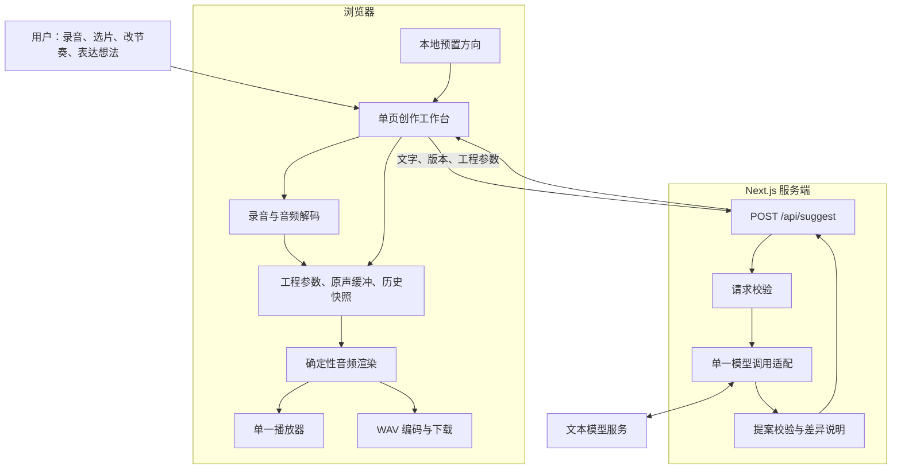

# MelodyMate 软件架构设计：两天黑客松 MVP

- 版本：v1.0
- 日期：2026-09-26
- 状态：设计方案；尚未实施或实测，不代表功能已经完成。
- 目标：用户用一个生活声音，亲手制作四小节音乐，通过 AI 建议和直接操作修改，最终导出 WAV。
- 工期前提：已有可用模型 API、Node.js 部署环境；开发者熟悉 TypeScript 与浏览器音频。约 16 个有效工时是目标预算，不是交付保证。

## 1. 范围与设计依据

用户已明确：从一个有趣声音开始，由 AI 引导探索；原声必须是作品的重要部分；允许少量系统和弦伴奏；优先两天完成、减少依赖。

本方案落实最新的“两天 MVP”约束。[用户流程](./用户流程.md)和[可行性分析报告](./可行性分析报告.md)中的较大范围保留为后续方向，不并入本轮开发验收；[需求分析](./需求分析.md)提供产品背景，不能替代技术实测。

| 维度 | 两天版本 | 后续方向 |
|---|---|---|
| 输入 | 单次录音或单个音频文件；最多 10 秒、10 MiB | 视频抽音、多素材 |
| 素材 | 一个手动裁切片段，建议 0.05～0.5 秒；优先敲击类声音 | 自动切片、音高与声音用途分析 |
| 创作 | 两个试听方向；用户修改节奏和参数 | 多风格、多轨、多段落 |
| 音乐结构 | 4/4 拍、四小节；每小节 16 步节奏重复四次 | 独立段落和变化段 |
| 时长 | 80/100/120 BPM，分别为 12/9.6/8 秒 | 15～25 秒及完整歌曲 |
| 伴奏 | 可关闭的一层合成和弦，两套预置进行 | 独立低音、鼓组、自由和声生成 |
| 编辑 | 音量、节奏格、速度、柔化滤波、伴奏方案 | 变调、混响、时间伸缩、段落编辑 |
| 保存 | 当前页面内存、最近五次修改撤销、WAV 导出 | 自动保存、跨设备、分享链接 |
| 平台 | 桌面 Chrome；HTTPS 或本机 localhost | 手机 Safari、原生应用 |

四小节不等于四个段落。本版本不继承“三分钟完成”“自动识别素材”等未经验证的体验承诺。导出为有清晰起止的短音乐，不承诺无缝循环拼接。

## 2. 核心架构决策

1. **单个 Next.js 应用。** 页面与一个服务端 API 在同一工程、同一域名下运行。
2. **浏览器完成全部音频处理。** 原始音频不发送给模型或业务服务器；服务器只接收描述和参数。
3. **文本模型提出受限参数方案。** 不生成音频、不执行模型生成的代码、不推断它未听到的音色或音高。
4. **工程参数是唯一创作状态。** 音频是工程渲染的结果；试听、撤销和导出都围绕版本操作。
5. **直接操作和 AI 修改使用同一套校验与提交逻辑。** 用户手改节奏后，AI 必须基于新版本继续。
6. **模型失败仍可制作。** 本地预置方向和直接控制保留；预置结果明确标注，不冒充 AI 输出。

## 3. 系统结构与职责



| 模块 | 职责 | 边界 |
|---|---|---|
| 工作台 | 素材选区、16 格节奏、候选试听、采纳、撤销 | 不直接调用模型供应商 |
| 输入模块 | 文件检查、录音、解码、生成新素材标识 | 不做降噪、音色分类或自动选片 |
| 工程模块 | 校验参数、提交新版本、维护历史、使旧候选失效 | 不保存或复制大音频缓冲到历史 |
| 渲染模块 | 根据原声与工程产生 PCM 音频 | 不访问模型，不随机改变音乐 |
| 播放模块 | 原声、候选、当前版本共用一次一个的播放通道 | 播放不修改工程 |
| AI 服务 | 将描述映射为白名单参数提案 | 无文件上传、数据库或音频生成 |
| 导出模块 | 把当前版本渲染缓冲编码成 WAV | 不在导出时重新调用模型 |

## 4. 页面、用户流程与运行状态

只有一个页面 `/`，用空态、录音态和已载入态组织内容：

- 顶部：录音、导入、载入本地示例。
- 素材区：用户命名、起止滑块、原声片段试听；初始选区仅是默认值，不宣称自动找到了最佳片段。
- 作品区：16 格节奏、速度、原声音量、柔化开关、伴奏开关和音量。
- 建议区：两个候选卡、修改对象、文字输入、试听与采纳；未命名声音使用“声音 1”。
- 底部：播放、停止、撤销、导出及进度/错误提示。

主流程：导入或录音 → 确认片段 → 获取两个方向 → 试听并采纳 → 手动/对话修改 → 导出。

素材载入后即生成一份本地默认工程，用户可以先播放和手改，不必等待模型。第一次使用不要求描述曲风或情绪；声音名称也可以稍后填写。

状态拆成三个独立维度：`inputStatus` 为 empty/recording/decoding/ready/error，`suggestStatus` 为 idle/pending/error，`audioStatus` 为 idle/rendering/playing/exporting/error。不使用一个总状态表达所有并发情况。

- 录音前停止播放；停止录音、报错或离开页面时关闭麦克风轨道。
- 每次选择新文件都增加载入序号；旧解码完成后不得覆盖新素材。
- 提交参数、撤销、替换素材时停止播放并回到起点，不做播放中无缝修改。
- 一次只允许一个 AI 请求；请求期间可手改，手改会使该请求的候选失效。
- 每次渲染绑定素材标识、版本和请求序号；过期渲染即使完成，也不自动播放或覆盖当前缓存。

## 5. 数据模型与版本规则

以下是实现契约，不表示已经存在相应代码文件。TypeScript 类型以运行时校验为补充。

```ts
type Step = 0 | 1;

type MusicParams = {
  bpm: 80 | 100 | 120;
  steps: Step[]; // 长度固定为 16，至少一个位置为 1
  sourceGain: number; // 0～1
  sourceTone: "original" | "soft";
  backingPreset: "off" | "p1" | "p2";
  backingGain: number; // 0～0.3
};

type Project = {
  schemaVersion: 1;
  revision: number;
  sourceId: string;
  sourceLabel: string;
  sourceDurationSec: number;
  trim: { startSec: number; endSec: number };
  bars: 4;
  params: MusicParams;
};

type Proposal = {
  id: string;
  title: string;
  explanation: string;
  patch: Partial<MusicParams>;
};

type SuggestRequest = {
  mode: "explore" | "edit";
  target: "source" | "backing" | "global";
  project: Project;
  message: string;
};

type SuggestResponse = {
  status: "suggestions" | "unsupported";
  baseRevision: number;
  source: "ai" | "preset";
  message: string;
  proposals: Proposal[];
};
```

`AudioBuffer` 独立放在浏览器内存，用 `sourceId` 关联；它不进入 JSON、API 请求或历史快照。原声文件只解码一次，裁切不破坏原始缓冲。

提交规则：

1. 直接操作与 AI 提案都先生成参数草稿，校验通过后才能提交。
2. 一次点击、一次滑块拖动结束或一次采纳，只形成一个历史记录；滑动过程中不生成大量版本。
3. `revision` 在页面会话内单调递增。撤销恢复旧参数，但分配新版本号；不能把版本号倒退。
4. 提案必须基于当前 `revision`；任何参数、选区或名称修改都会增加版本，使旧提案失效。
5. 保留最近五个修改前快照。替换素材后清空历史、候选与渲染缓存，不支持撤销到旧素材。
6. 首版不提供重做和历史收藏。刷新页面会丢失工程；界面明确提示先导出音频。

参数约束：裁切点必须有限、位于素材时长内，片段长度为 0.05～0.5 秒；所有数值禁止 NaN/Infinity；未知字段拒绝；空节奏不给提交，提示保留至少一格。静音原声通过音量实现，用于对比听感。

## 6. 唯一业务 API

### 6.1 请求与响应

`POST /api/suggest`，JSON 请求，不接收二进制音频或文件地址。服务端无工程数据库，收到的工程只作为这次建议的上下文。

初次探索传 `mode="explore"`、`target="global"`，允许 `message` 为空，返回两个候选。修改传 `mode="edit"` 和非空描述，返回一个候选；不支持的意图返回 `status="unsupported"`、空候选和可执行范围说明。

例如，当前版本为 3，用户选中伴奏并输入“伴奏小一点”，有效响应可以是：

```json
{
  "status": "suggestions",
  "baseRevision": 3,
  "source": "ai",
  "message": "可以先试听这个调整。",
  "proposals": [{
    "id": "proposal-1",
    "title": "伴奏更轻",
    "explanation": "伴奏音量从 0.18 调整为 0.10；原声节奏和参数保持不变。",
    "patch": { "backingGain": 0.1 }
  }]
}
```

该例要求请求中的 `backingGain` 为 0.18。最终解释由服务端根据校验后的差异生成，不照抄模型对已执行动作的描述；提案仍需用户采纳才成为当前作品。

### 6.2 修改权限与模型边界

| target | 可修改字段 |
|---|---|
| source | steps、sourceGain、sourceTone |
| backing | backingPreset、backingGain |
| global | MusicParams 中全部字段 |

AI 不得修改素材、选区、版本号或小节数。BPM 改变影响整个作品，所以必须选择“整体”。裁切始终通过直接操作完成。

模型只收到声音名称、时长、当前工程和用户描述。提示词明确：没有听过音频；名称是用户提供的标签；不得声称识别了物体、调性或音色；不得输出音频 URL、代码或未支持操作。

模型可以选择 p1/p2、节奏格、速度和音量组合。首版的“和弦生成”是受限方案选择与编排，不是识别原声调性后自由生成和声。保留这一边界用于产品说明和路演。

### 6.3 校验、超时与降级

- 请求体上限 16 KiB，描述最多 300 字、名称最多 40 字；这些为建议实现值，可在联调中调整。
- 对请求及模型响应检查完整结构、参数范围、数组长度、未知字段、目标字段权限；合并 patch 后再次校验工程。
- 服务端覆盖 `baseRevision` 为请求版本，自行分配提案 ID；不信任模型返回的这些字段。
- 两个探索候选必须在速度、节奏或伴奏至少一个可听参数上不同；重复候选视作无效响应。
- 上游调用预算约 10 秒，不自动多次重试。浏览器设置稍长超时，避免请求无限挂起。
- 无效客户端请求返回 400，过大请求返回 413；二者不触发模型调用或预置降级。
- 探索时，上游超时/无效结果使用两份本地规则候选，`source="preset"`。网络不可达时浏览器调用同一组纯函数生成预置候选。
- 编辑时，上游失败返回 503，保留当前作品；不把任意文字强行映射成修改。
- 不能执行的明确指令返回 200 和 `status="unsupported"`，例如“增加人声”或“第二段才进入”。

## 7. 音频引擎

### 7.1 输入与解码

录音使用 `getUserMedia` 和 `MediaRecorder`；用 `isTypeSupported()` 探测目标浏览器支持的 MIME 类型，不假定所有浏览器都输出同一格式。停止后合并完整录音 Blob 再解码，不能把每个录音分块都当作完整音频文件。

文件入口优先验收 WAV、MP3；浏览器不支持的格式给出换格式或重新录制提示，不在两天版引入转码工具。检查文件大小后读取，解码后再次检查时长、声道和可用数据。手机及任意编码组合不计入首版兼容承诺。

### 7.2 确定性编排

唯一渲染入口为 `renderProject(source: AudioBuffer, project: Project): Promise<AudioBuffer>`。原声选择与处理参数来自工程，不从聊天记录推断。

- 固定 4/4 拍；`steps[0..15]` 表示一个小节的十六分音符网格，四小节重复相同节奏。
- 第 `bar` 小节、第 `step` 格的开始时间为 `(bar * 4 + step / 4) * 60 / bpm`，其中 bar 为 0～3、step 为 0～15。
- 每次触发创建新的采样音源；保持原始音高和播放速率，首版不做变调或变速不变调。
- 每次采样起止增加约 3 ms 淡入淡出；超出作品末尾的片段截断并淡出。
- `sourceTone="soft"` 只对原声应用固定低通滤波；original 使用原声路径。滤波参数固定，避免开放复杂效果器。
- p1 的四小节和弦为 C–Am–F–G；p2 为 Am–F–C–G。采用固定音区的三和弦、三角波及简短音量包络；每小节一个和弦。
- 伴奏是规则合成音符，没有外部音源下载。off 不创建伴奏音源。
- 不使用随机音符和随机效果；同一素材和参数生成同一事件计划。

上述进行是待试听调优的默认方案，不保证与有明确音高的原声相容。首版优先打击类声音，伴奏可以关闭。

### 7.3 离线渲染、播放与导出

使用 `OfflineAudioContext` 生成单声道、44.1 kHz 浮点 PCM，长度为 `ceil(16 * 60 / bpm * 44100)` 个采样。输入缓冲按其实际采样率读取，不把文件采样率硬编码成 44.1 kHz。

首版无混响和延迟尾音；所有音源在固定终点之前结束，最终约 5 ms 淡出。混音后若绝对峰值超过 0.95，整体衰减至 0.95，不向上归一化安静录音。

局部修改保证未选中的参数和事件不变；防削波的整体衰减可能影响混音响度，不承诺最终混音中其他声部逐采样点不变。

- 参数修改后重新渲染，再播放；暂不实现实时音频图热更新。
- 缓存当前已渲染版本和最多两个候选，缓存关联 sourceId、revision 和候选 ID；新版本使旧缓存失效。
- 原声、候选、当前作品共用一个播放器。播放前停止旧音源；每次播放新建 `AudioBufferSourceNode`。
- 候选试听不写入工程。采纳后将其标记为新版本；匹配的候选缓冲可复用，也可按新版本重新渲染。
- 导出只接受当前已采纳工程，点击时冻结快照、停止播放并暂时禁用编辑；复用匹配缓冲或重新渲染一次。
- WAV 编码为单声道、44.1 kHz、16-bit PCM，生成 RIFF/WAVE 头并下载；编码过程不重新编排或调音。
- “原始片段”播放未经编排的裁切原声；“只听原声节奏”通过临时关闭伴奏试听编排结果。二者都不改变已采纳工程。

## 8. 建议代码目录与依赖

以下路径是后续实施时新增的文件，本轮只创建本架构文档。

```text
MelodyMate/
  app/
    layout.tsx
    page.tsx                       # 单页工作台，客户端组件
    globals.css
    api/suggest/route.ts            # 唯一业务 API
  components/
    SourcePanel.tsx                # 录音、导入、选区
    PatternEditor.tsx              # 节奏格与参数控制
    SuggestionsPanel.tsx           # 对话、候选、采纳
    TransportBar.tsx               # 播放、停止、撤销、导出
  lib/
    project.ts                     # 类型、默认值、工程 reducer
    validation.ts                  # 前后端共享的纯校验函数
    presets.ts                     # 和弦、默认节奏、预置探索方案
    audio-input.ts                 # 录音生命周期与解码
    audio-render.ts                # 采样与和弦渲染
    audio-playback.ts              # 单一播放器
    wav.ts                         # PCM 到 WAV
    model-client.ts                # 仅服务端使用的单供应商适配
  public/samples/                  # 自录、可使用的演示声音
  tests/                          # 参数边界、版本、WAV 等测试
  docs/软件架构设计-MVP.md
```

运行依赖限于 Next.js、React、React DOM；语言为 TypeScript，界面使用普通 CSS，状态使用 useReducer，服务端通过 fetch 调用模型。实际版本在开发首日选定并通过锁文件固定，不在设计文档猜测版本号。

不引入 Python、FFmpeg、librosa、Tone.js、状态管理库、数据库、Agent 框架或任务队列。若后续实施需要新增生产依赖，应按项目约定先获得用户同意。

## 9. 部署与数据边界

一个 Node.js 应用同时提供页面和 API，使用 HTTPS；本机演示可使用 localhost。需要支持服务端路由，不能仅部署静态导出文件。部署供应商可使用团队已有环境，首版不绑定尚未验证的腾讯内部接口。

服务端环境变量为 `MODEL_API_URL`、`MODEL_API_KEY`、`MODEL_NAME`，不使用客户端公开变量存密钥。第一小时选择一个已经能调用的供应商，协议差异集中在 model-client；首版不实现多供应商切换。

原声、录音 Blob、解码缓冲与导出音频留在浏览器。用户文字描述和工程参数发送到本应用服务端，再由服务端将必要字段发送给模型；不发送原始文件或音频数据，不在日志中保存请求正文或密钥。

演示部署采用单实例、每浏览器最多一个建议请求、服务端最多两个同时在途的模型调用；请求过量返回 429。上线公开长期服务所需的账户配额和持久化限流不属于本次范围。

## 10. 两天开发顺序

| 顺序 | 目标预算 | 交付物与验收 |
|---|---|---|
| D1-1 | 1 小时 | 工程初始化、模型凭证冒烟检查、Node/HTTPS 部署路径验证 |
| D1-2 | 2 小时 | 文件导入、解码、裁切与原声试听，形成工程契约 |
| D1-3 | 3 小时 | 默认节奏、两套和弦、离线渲染，真实原声能组成四小节作品 |
| D1-4 | 2 小时 | 单一播放器、WAV 编码、基础页面；不依赖模型即可导出 |
| D2-1 | 2 小时 | 16 格编辑、录音、参数控制、撤销和异步失效处理 |
| D2-2 | 2 小时 | AI API、响应校验、候选试听与采纳、失败降级 |
| D2-3 | 1 小时 | 原声辨识度与伴奏听感调优 |
| D2-4 | 3 小时 | 回归验收、部署检查、真实录音彩排和演示录屏 |

关键依赖：工程契约 → 音频渲染 → 试听与导出；工程契约 → 直接编辑与撤销 → AI 提案集成。两人可分别推进音频与界面/API，但首日必须合并到同一条可导出的流程。

首日结束的闸门是“导入 → 选片 → 四小节编排 → 试听 → WAV 导出”。若未达到，第二天先修这条链路，再接 AI；不增加自动识别、额外效果或视频能力。

## 11. 验证、风险与演示边界

后续实现应建立对应测试脚本；当前仓库尚无应用 package.json，因此本轮不声称运行了应用构建、类型检查或音频测试。

| 验证层 | 必须覆盖 |
|---|---|
| 纯逻辑 | 参数上下界、16 步合法性、裁切范围、target 白名单、未知字段拒绝 |
| 工程状态 | 手改后旧提案失效；撤销恢复参数且版本递增；换素材清理旧缓存和历史 |
| API | explore 恰好两个不同候选；edit 单候选；超时和非法模型响应不污染工程；unsupported 不伪装成功 |
| 音频文件 | WAV 头、声道、采样率、位深、数据长度正确；8/9.6/12 秒时长；PCM 无非有限值且峰值不超约定 |
| 浏览器 | 录音拒绝权限、格式解码失败、连续播放/停止、过期解码/渲染、导出后回放 |
| 产品听感 | 三种自录短声音各自完成闭环；原声可辨；节奏修改可听；关闭伴奏仍有明确原声节奏 |

| 风险 | 应对与取舍 |
|---|---|
| 合成伴奏简陋或与原声冲突 | 第一天下午就试听；降低伴奏、改固定音区；保留关闭入口，不承诺任意声音配和声 |
| 录音/解码兼容性耗时 | 首版只验收桌面 Chrome；录音失败仍可导入 WAV/MP3 和示例 |
| 大片段密集叠加或切片爆音 | 限定裁切长度、短包络、峰值检查；提供源音单独试听 |
| 模型把用户描述当成听觉事实 | 提示词禁止声称听过录音；说明由真实参数差异产生 |
| 模型不可用 | explore 使用标注清楚的预置候选；edit 报错，直接编辑和导出继续可用 |
| 连续点击造成串音/旧结果覆盖 | 播放唯一实例、请求序号、revision 校验、提交时停止播放 |
| 刷新丢失工程 | 明确告知只在本次页面会话保存，及时导出；不承诺项目恢复 |
| 工期不足 | 依次删减界面动效、额外听感效果、录音入口；保留文件导入、节奏编辑、原声对照、撤销与导出 |

最终演示：导入一个真实声音 → 截取 → 试听两种方向 → 改一格节奏 → 用一句话调整伴奏 → 采纳 → 撤销 → 导出。成功标准是用户能辨认自己的原声并指出自己做过的修改。

如果模型没有真实接通，应说明目前展示的是交互原型与规则编排；预置方案不能作为 AI 实际调用的证据。所有性能、听感与完成时间目标都需要原型验证后再写入对外承诺。

## 12. 技术参考

- [Next.js Route Handlers](https://nextjs.org/docs/app/getting-started/route-handlers)：在同一应用中提供 HTTP API。
- [MediaRecorder 格式检测](https://developer.mozilla.org/en-US/docs/Web/API/MediaRecorder/isTypeSupported_static)：录音前探测 MIME 类型支持。
- [decodeAudioData](https://developer.mozilla.org/en-US/docs/Web/API/BaseAudioContext/decodeAudioData)：解码完整音频数据，注意采样率处理。
- [OfflineAudioContext](https://developer.mozilla.org/en-US/docs/Web/API/OfflineAudioContext)：离线渲染到 AudioBuffer，仍需另行编码 WAV。
- [AudioBufferSourceNode](https://developer.mozilla.org/en-US/docs/Web/API/AudioBufferSourceNode)：采样播放与音源生命周期。

本文件记录软件架构和实施边界；现有浏览器 API 能力不等于该产品已实现，仍需按第 11 节验证。
