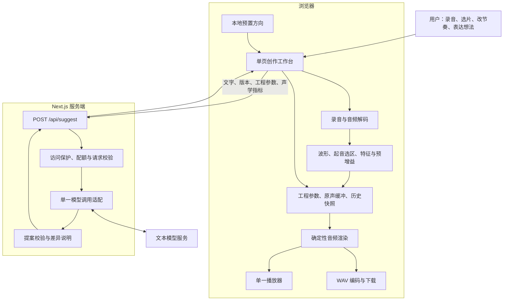

# MelodyMate 软件架构设计：两天黑客松 MVP

- 版本：v1.1（设计审查修订）
- 日期：2026-09-28
- 状态：设计方案；尚未实施或实测，不代表功能已经完成。
- 目标：用户用一个生活声音，亲手制作四小节音乐，通过 AI 建议和直接操作修改，最终导出 WAV。
- 工期前提：按你和搭档两人并行、每天各 8 小时估算，共 32 人时，其中最后半天预留每人 3 小时处理异常与彩排。需要熟悉 TypeScript、可用模型凭证及部署环境；新增波形与特征分析后，不再沿用一人 16 工时的预算。

## 1. 范围与设计依据

用户已明确：从一个有趣声音开始，由 AI 引导探索；原声必须是作品的重要部分；允许少量系统和弦伴奏；优先两天完成、减少依赖。

本方案落实最新的“两天 MVP”约束。[用户流程](./用户流程.md)和[可行性分析报告](./可行性分析报告.md)中的较大范围保留为后续方向，不并入本轮开发验收；[需求分析](./需求分析.md)提供产品背景，不能替代技术实测。

本次修订增加原声预增益、轻量声学特征、短录音与波形、默认起音选区、固定四小节变化，并补齐播放解锁和演示访问保护。为控制范围，首版不实现频谱质心和音高置信度：没有可靠音高估计时，不依据“低置信度”自动添加和弦。产品表述为“AI 根据声音的轻量声学指标与你的想法提出编排建议”，不能宣称识别了声源物体或调性。

| 维度 | 两天版本 | 后续方向 |
|---|---|---|
| 输入 | 录音约 2 秒自动停止；文件最多 10 秒、10 MiB | 视频抽音、多素材 |
| 素材 | 简单波形、一个默认起音选区，手动调整到 0.05～0.5 秒；优先敲击类声音 | 多切片、语义与音高识别 |
| 声音分析 | 浏览器提取五个时域指标，原声有限增益；指标随建议请求发送 | 频谱分析、音高检测、降噪 |
| 创作 | 两个试听方向；用户修改节奏和参数 | 多风格、多轨、多段落 |
| 音乐结构 | 4/4 拍、四小节；一个 16 步底稿派生进入、完整、变化、结尾 | 自由段落、多轨时间线 |
| 时长 | 80/100/120 BPM，分别为 12/9.6/8 秒 | 15～25 秒及完整歌曲 |
| 伴奏 | 默认关闭，用户允许后 AI 可选两套预置和弦；低音量合成 | 独立低音、鼓组、自由和声生成 |
| 编辑 | 音量、节奏格、速度、柔化滤波、伴奏方案 | 变调、混响、时间伸缩、段落编辑 |
| 保存 | 当前页面内存、最近五次修改撤销、WAV 导出 | 自动保存、跨设备、分享链接 |
| 平台 | 桌面 Chrome；HTTPS 或本机 localhost | 手机 Safari、原生应用 |

四小节不等于四个段落。本版本不继承“三分钟完成”“自动识别素材”等未经验证的体验承诺。导出为有清晰起止的短音乐，不承诺无缝循环拼接。

## 2. 核心架构决策

1. **单个 Next.js 应用。** 页面与一个服务端 API 在同一工程、同一域名下运行。
2. **浏览器完成全部音频处理。** 原始音频不上传；建议服务只接收文字、参数与汇总声学指标。指标也属于用户数据，不宣称完全没有数据离开设备。
3. **文本模型提出受限参数方案。** 可参考指标作启发式建议；不直接听音频、不生成音频、不执行代码，不把时域指标解释成可靠的物体、音色或调性识别。
4. **工程参数是唯一创作状态。** 音频是工程渲染的结果；试听、撤销和导出都围绕版本操作。
5. **直接操作和 AI 修改使用同一套校验与提交逻辑。** 用户手改节奏后，AI 必须基于新版本继续。
6. **模型失败仍可制作。** 本地预置方向和直接控制保留；预置结果明确标注，不冒充 AI 输出。

## 3. 系统结构与职责



| 模块 | 职责 | 边界 |
|---|---|---|
| 工作台 | 波形与选区、16 格节奏、四小节预览、候选试听与撤销 | 不直接调用模型供应商 |
| 输入模块 | 短录音、文件检查、解码、生成新素材标识 | 不做视频转码或降噪 |
| 分析模块 | 默认起音选区、时域指标、归一化增益 | 不识别物体、音高或调性；不自动提交选区修改 |
| 工程模块 | 校验参数、提交新版本、维护历史、使旧候选失效 | 不保存或复制大音频缓冲到历史 |
| 渲染模块 | 根据原声与工程产生 PCM 音频 | 不访问模型，不随机改变音乐 |
| 播放模块 | 原声、候选、当前版本共用一次一个的播放通道 | 播放不修改工程 |
| AI 服务 | 根据描述及指标提出白名单参数提案 | 不接收原声、不保存工程、不生成音频 |
| 导出模块 | 把当前版本渲染缓冲编码成 WAV | 不在导出时重新调用模型 |

## 4. 页面、用户流程与运行状态

只有一个页面 `/`，用空态、录音态和已载入态组织内容：

- 顶部：约 2 秒录音、导入、载入本地示例。
- 素材区：Canvas 波形、默认起音选区、选区局部放大、可拖动边界与 10 ms 微调按钮、原声试听；默认选区是能量变化启发式，不宣称找到了最佳片段。显示“已提升原声”或“声音仍太轻，请靠近重录”。
- 作品区：16 格底稿、四小节只读预览、重复/起承变化开关、速度、原声音量、柔化开关；独立的“允许和弦伴奏”默认关闭。
- 建议区：两个候选卡、修改对象、文字输入、试听与采纳；未命名声音使用“声音 1”。
- 底部：播放、停止、撤销、导出及进度/错误提示。

主流程：导入或录音 → 确认片段 → 获取两个方向 → 试听并采纳 → 手动/对话修改 → 导出。

素材载入后先建议一个选区，并计算该选区的指标与预增益，再生成本地默认工程；用户确认或调整后开始探索。用户可以先播放和手改，不必等待模型。第一次使用不要求描述曲风或情绪；声音名称也可以稍后填写。

状态拆成三个独立维度：`inputStatus` 为 empty/recording/decoding/analyzing/ready/error，`suggestStatus` 为 idle/pending/error，`audioStatus` 为 idle/rendering/playing/exporting/error。不使用一个总状态表达所有并发情况。

- 录音前停止播放；停止录音、报错或离开页面时关闭麦克风轨道。
- 每次选择新文件都增加载入序号；旧解码完成后不得覆盖新素材。
- 裁切提交后重新分析，分析完成前禁用 AI 请求和成品导出；结果必须匹配素材和选区。名称或节奏改变可复用相同选区的分析数据，但仍使旧候选失效。
- 提交参数、撤销、替换素材时停止播放并回到起点，不做播放中无缝修改。
- 一次只允许一个 AI 请求；请求期间可手改，手改会使该请求的候选失效。
- 每次渲染绑定素材标识、版本和请求序号；过期渲染即使完成，也不自动播放或覆盖当前缓存。
- 用户点击任意播放按钮时，同步创建播放 AudioContext 或调用 resume()，随后才等待分析/离线渲染；恢复失败时提示再次点击，不显示假播放状态。具体契约见第 7.6 节。

## 5. 数据模型与版本规则

以下是实现契约，不表示已经存在相应代码文件。TypeScript 类型以运行时校验为补充。

```ts
type Step = 0 | 1;

type MusicParams = {
  bpm: 80 | 100 | 120;
  steps: Step[]; // 长度固定为 16，至少一个位置为 1
  structurePreset: "repeat" | "mini";
  sourceGain: number; // 归一化之后的音量，0.5～1，默认 1
  sourceTone: "original" | "soft";
  backingPreset: "off" | "p1" | "p2";
  backingGain: number; // 0～0.12，默认 0.08；默认 preset 为 off
};

type Project = {
  schemaVersion: 2;
  revision: number;
  sourceId: string;
  sourceLabel: string;
  sourceDurationSec: number;
  trim: { startSec: number; endSec: number };
  bars: 4;
  backingAllowed: boolean; // 默认 false；只有用户直接操作可以修改
  params: MusicParams;
};

type SourceFeatures = {
  peak: number;               // 选区 PCM 的绝对峰值，归一化之前
  rms: number;                // 均方根幅度，归一化之前
  durationMs: number;         // 当前选区时长，不是原文件时长
  zeroCrossingRate: number;   // 相邻样本符号变化占比，0～1
  transientScore: number;     // 10 ms 帧 RMS 最大正差分比，0～1
};

type SourceAnalysis = {
  analysisVersion: 1;
  sourceId: string;
  startFrame: number;         // 含起点
  endFrame: number;           // 不含终点
  sampleRate: number;         // 解码后 AudioBuffer.sampleRate
  features: SourceFeatures;
  normalizationGain: number; // 由选区派生，不是模型可调参数
  quality: "usable" | "tooQuiet" | "nearSilent";
};

type Proposal = {
  id: string;
  title: string;
  explanation: string;
  patch: Partial<MusicParams>;
};

type SuggestRequest = {
  mode: "explore" | "edit";
  target: "source" | "backing" | "global";
  project: Project;
  analysis: SourceAnalysis;
  message: string;
};

type SuggestResponse = {
  status: "suggestions" | "unsupported";
  baseRevision: number;
  source: "ai" | "preset";
  message: string;
  proposals: Proposal[];
};
```

`AudioBuffer` 独立放在浏览器内存，用 `sourceId` 关联；它不进入 JSON、API 请求或历史快照。原声文件只解码一次，裁切不破坏原始缓冲。

分析结果为派生缓存，键为 `sourceId + startFrame + endFrame + sampleRate + analysisVersion`；参数历史只存工程，不把 normalizationGain 当成可独立撤销的旋钮。选区按解码采样率取整并回写秒数，使分析、播放和导出使用同一组样本；起点向下、终点向上取整，长度容许不超过两个采样的舍入误差。AI 请求发送当前工程和匹配的分析；服务端能校验范围与对应关系，但无法证明客户端特征真实，不能把特征用于权限或配额判断。

提交规则：

1. 直接操作与 AI 提案都先生成参数草稿，校验通过后才能提交。
2. 一次点击、一次滑块拖动结束或一次采纳，只形成一个历史记录；滑动过程中不生成大量版本。
3. `revision` 在页面会话内单调递增。撤销恢复旧参数，但分配新版本号；不能把版本号倒退。
4. 提案必须基于当前 `revision`；任何参数、选区或名称修改都会增加版本，使旧提案失效。
5. 保留最近五个修改前快照。替换素材后清空历史、候选与渲染缓存，不支持撤销到旧素材。
6. 首版不提供重做和历史收藏。刷新页面会丢失工程；界面明确提示先导出音频。
7. 用户关闭伴奏许可时，`backingAllowed=false` 与 `backingPreset="off"` 一次提交；开启许可不自动采纳伴奏。更换素材或选区也关闭许可和伴奏，避免沿用不适合新声音的和弦；撤销恢复同一素材下的完整工程快照。

参数约束：裁切点必须有限、位于素材时长内，片段长度为 0.05～0.5 秒；所有数值禁止 NaN/Infinity；未知字段拒绝；空节奏不给提交，提示保留至少一格。已采纳工程中原声不得完全静音，sourceGain 下限为 0.5；“只听伴奏”属于临时对比状态，不得采纳或导出。

声音质量也属于统一操作约束：每次直接编辑音乐参数、采纳、撤销恢复、编排渲染及导出，都检查当前选区分析。nearSilent 状态保留素材更换、选区修改、撤销和原始片段试听；该状态可保存为待修正的素材草稿，但不能制作或导出作品。quality 不为 usable 时，backingPreset 必须为 off。撤销到 nearSilent 选区时恢复为待修正状态，不能自动播放；撤销到有效选区则重新开放相应操作。

## 6. 唯一业务 API

### 6.1 请求与响应

`POST /api/suggest`，JSON 请求，不接收二进制音频或文件地址。服务端无工程数据库，收到的工程只作为这次建议的上下文。

初次探索传 `mode="explore"`、`target="global"`，允许 `message` 为空，返回两个候选。修改传 `mode="edit"` 和非空描述，返回一个候选；不支持的意图返回 `status="unsupported"`、空候选和可执行范围说明。

例如，当前版本为 3，用户选中伴奏并输入“伴奏小一点”，有效响应可以是：

```json
{
  "status": "suggestions",
  "baseRevision": 3,
  "source": "ai",
  "message": "可以先试听这个调整。",
  "proposals": [{
    "id": "proposal-1",
    "title": "伴奏更轻",
    "explanation": "伴奏音量从 0.08 调整为 0.04；原声节奏和参数保持不变。",
    "patch": { "backingGain": 0.04 }
  }]
}
```

该例要求请求中伴奏已获用户许可、已开启，`backingGain` 为 0.08。最终解释由服务端根据校验后的差异生成，不照抄模型对已执行动作的描述；提案仍需用户采纳才成为当前作品。

### 6.2 修改权限与模型边界

| target | 可修改字段 |
|---|---|
| source | steps、structurePreset、sourceGain、sourceTone |
| backing | backingPreset、backingGain |
| global | MusicParams 中全部字段 |

AI 不得修改素材、选区、版本号、小节数、分析结果或伴奏许可。BPM 改变影响整个作品，所以必须选择“整体”。起音算法只提供初始选区，后续裁切始终通过直接操作确认。

模型收到声音名称、时长、当前工程、用户描述与 SourceAnalysis 汇总。提示词明确：没有直接听音频；名称是用户提供的标签；指标只支持有限的时域推断，不证明音色、物体、调性或音高；不得输出音频 URL、代码或未支持操作。

例如，较明显的帧间能量上升可以作为尝试稀疏节奏的依据，持续能量可以作为尝试留白的依据；这些是可试听的编排选择，不是声音分类结果。零交叉率必须结合 sampleRate 解读，不能单独把声音判为“清脆”或“低沉”。建议区显示由代码生成的指标摘要及实际参数差异，使用户能区分测量事实与模型建议。

`backingAllowed=false` 或选区质量不是 usable 时，所有候选必须维持 `backingPreset="off"`。即使用户在文字中要求加和弦，也先引导其打开许可开关；模型不能替用户授权。两套探索方案可通过节奏、速度和结构区分，不依赖伴奏才能成立。

模型可以选择 p1/p2、节奏格、速度和音量组合。首版的“和弦生成”是受限方案选择与编排，不是识别原声调性后自由生成和声。保留这一边界用于产品说明和路演。

### 6.3 校验、超时与降级

- 请求体上限 16 KiB，描述最多 300 字、名称最多 40 字；这些为建议实现值，可在联调中调整。
- 对请求及模型响应检查完整结构、参数范围、数组长度、未知字段、目标字段权限、分析与选区匹配及伴奏许可；合并 patch 后再次校验工程。前后端使用同一纯函数；原声增益下限不允许模型突破。
- 检查帧范围与 durationMs/sampleRate 对应、peak/rms 非负且 rms 不大于 peak（允许数值误差）、ZCR/瞬态分在 0～1；按 peak 复算 normalizationGain 与 quality，拒绝不一致数据。nearSilent 请求返回 400 和明确的素材错误码，不调用模型，也不生成探索降级候选。该校验仍无法核实特征是否来自真实音频。
- 服务端覆盖 `baseRevision` 为请求版本，自行分配提案 ID；不信任模型返回的这些字段。
- 两个探索候选在展开为实际事件后，须在速度、节奏、力度结构或已开启的伴奏上至少有一处可听变化；只修改处于关闭状态的伴奏参数不算不同。编辑提案也须有实际可听差异，空 patch 不伪装成成功。
- 上游调用预算约 10 秒，不自动多次重试。浏览器设置稍长超时，避免请求无限挂起。
- 无效客户端请求返回 400，过大请求返回 413；二者不触发模型调用或预置降级。
- 探索时，上游超时/无效结果使用两份本地规则候选，`source="preset"`。网络不可达时浏览器调用同一组纯函数生成预置候选。
- 编辑时，上游失败返回 503，保留当前作品；不把任意文字强行映射成修改。
- 不能执行的明确指令返回 200 和 `status="unsupported"`，例如“增加人声”或“第二段才进入”。
- 访问校验失败返回 403；超出频率、并发或演示配额返回 429，不继续调用模型。探索可以明确切换到本地预置；这些状态不能伪装成云端 AI 成功。

## 7. 音频引擎

### 7.1 输入与解码

录音使用 `getUserMedia` 和 `MediaRecorder`，约 2 秒主动停止并关闭轨道；计时器不保证采样级精度，解码后保留前 2 秒作为本次素材。用 `isTypeSupported()` 探测 MIME 类型，不假定所有浏览器输出同一格式。停止后合并完整录音 Blob 再解码，不能把每个录音分块当作完整音频文件。

文件入口优先验收 WAV、MP3；浏览器不支持的格式给出换格式或重新录制提示，不在两天版引入转码工具。检查文件大小后读取，解码后再次检查时长、声道和可用数据。手机及任意编码组合不计入首版兼容承诺。

`decodeAudioData()` 会将音频重采样至解码上下文的采样率；后续索引、裁切、特征和调度均以返回的 `AudioBuffer.sampleRate` 为事实来源，不以源文件元数据推断。输出统一 44.1 kHz，由离线上下文处理采样率差异。[MDN 解码说明](https://developer.mozilla.org/en-US/docs/Web/API/BaseAudioContext/decodeAudioData)

### 7.2 波形与默认选区

用 Canvas 按每像素对应样本的最小值/最大值画波形，不引入波形库。展示全局波形与选区附近的局部放大；拖动边界与 10 ms 微调共用选区校验。

默认选区基于全素材的 10 ms 帧 RMS：找相邻真实帧最大的正能量差分，将起点提前约 20 ms，取约 250 ms。差分与最高帧 RMS 的比小于 0.2 时改用最高能量帧；并列取较早位置。选区平移到素材边界以内，短素材取可用长度；不足 50 ms 则提示换素材。0.2 等数值只是首轮彩排参数，不是经过验证的声音分类阈值。

算法只在新素材载入时给初始候选，不随手动编辑重新抢选区。它可能选中噪声或碰麦声，因此必须可试听、可调整，界面不能显示“最佳声音已识别”。

### 7.3 轻量声音特征

当前选区按各声道等权平均转成单声道，再减去该选区均值以去除直流偏置；分析与编排使用同一份预处理 PCM。原始文件缓冲保持不变，原始片段试听仍可对照。非有限 PCM 数据拒绝处理。

对预增益之前的选区 x，N 为样本数，Fs 为解码后采样率：

```text
peak = max(abs(x[n]))
rms = sqrt(sum(x[n]^2) / N)
durationMs = 1000 * N / Fs
zeroCrossingRate = 相邻样本符号变化次数 / (N - 1)
frameRms[k] = 第 k 个约 10 ms 不重叠窗口的 RMS
transientScore = max(max(0, frameRms[k] - frameRms[k-1]))
                 / max(max(frameRms), 1e-8)             // 仅 k >= 1
```

过零判断按 `x[n] >= 0` 的布尔值是否改变计数；最后一个不满窗口按实际样本数计算 RMS。无可比较帧时 transientScore 为 0；不要虚构前一帧为零，否则持续音首帧也会得到很高分。peak/rms 是线性幅度，不是 LUFS 或声压级；ZCR 比例必须携带 Fs 才可跨采样率解释。

第一版不加入 FFT、spectralCentroid 或 pitchConfidence，也不返回假的零值占位。有限时域指标不能可靠识别声音物体或音高；低音高置信度即使未来存在，也只代表不确定，不能作为固定和弦安全的证明。

### 7.4 原声预增益与听感边界

```text
若 peak < 1e-4：quality = nearSilent，normalizationGain = 1
否则：normalizationGain = min(6, 0.75 / peak)
      quality = (peak * normalizationGain < 0.1) ? tooQuiet : usable
每次原声触发增益 = normalizationGain * sourceGain * 结构力度
```

nearSilent 只保留原始片段试听、选区/素材修正和撤销，不进入 AI 编排或导出。tooQuiet 可制作纯原声作品，但提示靠近重录，并保持伴奏关闭。阈值是演示初值，须用目标设备录音校准；它们只判断幅度，不能区分有用声音与噪声。

该策略会把正常选区峰值调整至约 0.75，最多放大 6 倍；增益到顶仍安静时不能继续无上限放大。sourceGain 的 0.5～1 是归一化后的用户音量，默认 1。normalizationGain 不由 AI 设置，裁切变化后重算。

峰值调整不等于感知响度归一化，也不会改善信噪比。伴奏默认关闭、三和弦各音幅度乘 1/3、伴奏总增益不超过 0.12；最终还要用真实录音验证原声辨识度。首版不增加自动闪避、降噪或额外声部渲染，不宣称数学上保证任何素材都不会被掩盖。

### 7.5 确定性编排

唯一渲染入口为 `renderProject(source: AudioBuffer, project: Project): Promise<AudioBuffer>`。原声选择与处理参数来自工程，不从聊天记录推断。

- 固定 4/4 拍；`steps[0..15]` 是唯一可编辑的小节底稿，structurePreset 派生四小节的原声事件；不生成四份独立可编辑状态。渲染内部调用同一选区分析纯函数，可复用匹配缓存，不能信任旧 normalizationGain。
- 第 `bar` 小节、第 `step` 格的开始时间为 `(bar * 4 + step / 4) * 60 / bpm`，其中 bar 为 0～3、step 为 0～15。
- 每次触发创建新的采样音源；保持原始音高和播放速率，首版不做变调或变速不变调。
- 每次采样起止增加约 3 ms 淡入淡出；超出作品末尾的片段截断并淡出。
- `sourceTone="soft"` 只对原声应用固定低通滤波；original 使用原声路径。滤波参数固定，避免开放复杂效果器。
- p1 的四小节和弦为 C–Am–F–G；p2 为 Am–F–C–G。采用固定音区的三和弦、三角波及简短音量包络；每小节一个和弦，三个振荡器先各乘 1/3，再应用 backingGain。
- 伴奏是规则合成音符，没有外部音源下载。off 不创建伴奏音源。
- 不使用随机音符和随机效果；同一素材和参数生成同一事件计划。

上述进行是待试听调优的默认方案，不保证与有明确音高的原声相容。首版优先打击类声音，伴奏可以关闭。

结构规则：repeat 为四小节原样重复，力度均为 1；mini 为默认方案，按如下规则展开。这里的“第几个触发”按一小节内时间顺序计数，从 1 开始。

| 小节 | 原声事件规则 | 力度 |
|---|---|---|
| 进入 | 保留底稿第 1、3、5……个触发，至少一个 | 0.8 |
| 完整 | 使用完整底稿 | 1 |
| 变化 | 使用完整底稿；交替轻重，不随机加音符 | 奇数触发 0.7，偶数 1 |
| 结尾 | 保留 step < 12 的触发，最后一拍不新触发；若为空，在 step 0 放一个收尾声音 | 1 |

结尾兜底触发属于明确的结构规则，必须展示在四小节只读预览中，不能让用户误以为关掉的格子被 AI 悄悄打开。采样尾音可延续至作品终点前。structurePreset 只改变原声事件，伴奏和弦顺序保持不变，因此允许在 target=source 中修改。

### 7.6 离线渲染、播放与导出

使用 `OfflineAudioContext` 生成单声道、44.1 kHz 浮点 PCM，长度为 `ceil(16 * 60 / bpm * 44100)` 个采样。选区读取遵循解码后的 sampleRate；44100 只用于输出时间轴与 WAV 头。

首版无混响和延迟尾音；所有音源在固定终点之前结束，最终约 5 ms 淡出。原声已在混音前做有限预增益；混音后若绝对峰值超过 0.95，整体衰减至 0.95，不再向上归一化整段混音。

局部修改保证未选中的参数和事件不变；防削波的整体衰减可能影响混音响度，不承诺最终混音中其他声部逐采样点不变。

- 参数修改后重新渲染，再播放；暂不实现实时音频图热更新。
- 播放点击处理函数在任何网络或渲染 await 之前调用实时 AudioContext 的创建/resume，并处理恢复 Promise。恢复后才启动音源；渲染完成时再检查上下文为 running、版本和播放序号仍匹配。若已停止、已换素材或恢复被拒绝，不自动补播。离线渲染不承担解除实时播放限制的职责。[Chrome 播放策略说明](https://developer.chrome.com/blog/web-audio-autoplay)
- 缓存当前已渲染版本和最多两个候选，缓存关联 sourceId、revision 和候选 ID；新版本使旧缓存失效。
- 原声、候选、当前作品共用一个播放器。播放前停止旧音源；每次播放新建 `AudioBufferSourceNode`。
- 候选试听不写入工程。采纳后将其标记为新版本；匹配的候选缓冲可复用，也可按新版本重新渲染。
- 导出只接受当前已采纳工程，点击时冻结快照、停止播放并暂时禁用编辑；复用匹配缓冲或重新渲染一次。
- WAV 编码为单声道、44.1 kHz、16-bit PCM，生成 RIFF/WAVE 头并下载；编码过程不重新编排或调音。
- “原始片段”播放未经编排、未经预增益的裁切原声；“只听原声节奏”临时关闭伴奏；“只听伴奏”临时静音原声。三种对照均不改变已采纳工程，导出始终忽略临时静音状态。

## 8. 建议代码目录与依赖

以下路径是后续实施时新增的文件，本轮只修订本架构文档。

```text
MelodyMate/
  app/
    layout.tsx
    page.tsx                       # 单页工作台，客户端组件
    globals.css
    api/suggest/route.ts            # 唯一业务 API
  components/
    SourcePanel.tsx                # 短录音、导入、波形与选区
    PatternEditor.tsx              # 节奏底稿、四小节预览与参数
    SuggestionsPanel.tsx           # 对话、候选、采纳
    TransportBar.tsx               # 播放、停止、撤销、导出
  lib/
    project.ts                     # 类型、默认值、工程 reducer
    validation.ts                  # 前后端共享的纯校验函数
    presets.ts                     # 和弦、默认节奏、预置探索方案
    audio-input.ts                 # 录音生命周期与解码
    source-analysis.ts             # 默认选区、五项特征、预增益
    arrangement.ts                 # repeat/mini 派生事件，无随机性
    audio-render.ts                # 采样与和弦渲染
    audio-playback.ts              # 单一播放器
    wav.ts                         # PCM 到 WAV
    model-client.ts                # 仅服务端使用的单供应商适配
    request-guard.ts                # 服务端口令、Origin、实例内限流
  public/samples/                  # 自录、可使用的演示声音
  tests/                          # 参数边界、版本、WAV 等测试
  docs/软件架构设计-MVP.md
```

运行依赖限于 Next.js、React、React DOM；语言为 TypeScript，界面使用普通 CSS，状态使用 useReducer，服务端通过 fetch 调用模型。实际版本在开发首日选定并通过锁文件固定，不在设计文档猜测版本号。

不引入 Python、FFmpeg、librosa、Tone.js、状态管理库、数据库、Agent 框架或任务队列。若后续实施需要新增生产依赖，应按项目约定先获得用户同意。

## 9. 腾讯接入、部署与数据边界

### 9.1 TokenHub 接入

首选 TokenHub 的 OpenAI Chat Completions 兼容接口，通过服务端 fetch 调用，不增加 SDK。广州站的 base URL 为 `https://tokenhub.tencentmaas.com/v1`，完整调用地址为 `https://tokenhub.tencentmaas.com/v1/chat/completions`，使用 `Authorization: Bearer API_KEY` 与 JSON 请求体；不要重复拼接 `/v1`。模型需已在对应站点开通，Key 与站点必须匹配。[TokenHub 官方调用概览](https://cloud.tencent.com/document/product/1823/130079)

环境变量 `MODEL_API_URL` 存上述完整地址，`MODEL_API_KEY` 和 `MODEL_NAME` 均只在服务端读取，不使用 NEXT_PUBLIC 前缀。第一小时验证真实请求、模型标识、输出长度限制与超时行为；首版只接一个供应商、一个固定模型，客户端不能修改 URL 或模型。

采用非流式短响应，单次输出预算以 1024 tokens 为初始目标，具体长度参数按选定模型验证；优先选择适合短结构化回答的模型。没有经过验证的 JSON 模式时，用提示词要求 JSON 并执行已有运行时校验；不假定“协议兼容”代表所有工具调用、推理及结构化输出选项完全等价。

旧混元兼容页明确提出逐步迁移至 TokenHub，但该页未给统一停服日期；不同站点、模型和专项接口公告不能合并为“所有混元 API 同日停服”。本项目直接使用新入口。[混元迁移说明](https://cloud.tencent.com/document/product/1729/111007)

### 9.2 部署选择

默认采用团队已有环境中的一个常驻 Node.js 进程，同时提供 Next.js 页面和 API；对外使用 HTTPS，本机演示可用 localhost。需要支持服务端路由，不能只部署静态导出文件。没有现成云环境时先保留本机演示，避免把临时搭建云环境挤进音频开发时间。

腾讯 SCF 的 HTTP Web 函数可作为替代部署路线，不需要拆成两个工程。但官方 Next.js 教程的示例仍使用 Nodejs 12.16 和旧启动方式，不能直接当作当前项目的部署模板。应在第一小时锁定相容的 Next.js/Node 版本，并验证生产构建、启动、页面、静态资源及 `/api/suggest`；若该路线未及时跑通，回到常驻 Node.js 或本机方案。[SCF Next.js 部署说明](https://intl.cloud.tencent.com/ind/document/product/583/41593)

### 9.3 演示访问保护与用量限制

两天版面向封闭演示，保护的是会产生模型调用的接口。具体顺序为：请求大小/Origin 检查 → 来源频率限制 → 演示口令与结构校验 → 并发名额 → 上游调用。

- 演示页面提供一次口令输入，值仅保存在页面内存，每次建议请求以 `X-Demo-Token` 携带；服务端与 `DEMO_ACCESS_TOKEN` 比对。口令使用独立随机值，不能复用模型 Key、写入 URL、客户端构建产物或日志；刷新后重新输入。未配置口令时云端建议接口拒绝开放。
- `APP_ORIGIN` 为明确配置的本站 origin；Origin 缺失或不匹配则拒绝。Origin 只是补充检查，非浏览器客户端可以伪造，不能替代口令校验。
- 每个浏览器最多一个待处理请求；单进程内每来源 IP 每分钟最多 10 次建议请求、最多两个同时在途的模型请求。IP 只采信部署平台可信代理提供的来源，不直接信任任意 `X-Forwarded-For`；来源不可可靠区分时按同一来源保守计数。计数项按窗口过期清理。
- 单实例内存计数重启即清空，也不能限制 SCF 其他实例。若采用 SCF，仍保留口令及实例内保护，严格跨实例 IP 限频交给已验证的网关/共享原子存储；没有这些能力时只做封闭演示，不对外宣称全局限流已完成。
- 为演示使用独立 TokenHub Key，限定可访问模型并配置日 Token 限额；这项控制位于模型平台，避免为两天版自建持久化预算数据库。平台文档说明达到额度后调用失败，免费包不计入限额；国内 API 也提供日/月/总额度字段。[API Key 管理](https://intl.cloud.tencent.com/zh/document/product/1300/78949)、[国内额度数据结构](https://cloud.tencent.com/document/api/1823/132279)

日 Token 限额不是人民币金额硬上限，也不覆盖云函数等资源费用；文档没有给出在途并发请求的精确超额边界。演示前核实目标账号的额度设置及失败响应，遇到明确限额错误停止云端请求并显示本地预置入口，不自动重试。若以后要求严格全局次数或金额准入，另行引入持久化、原子的预占与结算机制，不放进本轮。

### 9.4 数据流

原声、录音 Blob、解码缓冲与导出音频留在浏览器。用户文字、工程参数和少量声学汇总指标发送到本应用服务端，再由服务端发送必要上下文给模型；不上传原始音频、完整波形或频谱。声学指标也属于上传数据，应在页面说明中列明。不在日志中保存请求正文、演示口令或模型密钥。

## 10. 两天开发顺序

| 顺序 | 两人共同经过的时间 | 交付物与验收 |
|---|---|---|
| D1-1 | 1 小时 | 共同冻结契约；一人初始化并验证部署，另一人验证 TokenHub 模型与 Key 额度能力 |
| D1-2 | 2 小时 | A：导入、解码、默认选区与特征；B：工作台、Canvas 波形与局部选区控制 |
| D1-3 | 3 小时 | A：预增益、结构事件与离线渲染；B：编辑 reducer、AI API、访问保护和响应校验 |
| D1-4 | 2 小时 | 联通播放、WAV 与页面；真实原声先完成不依赖模型的导出闭环 |
| D2-1 | 2 小时 | A：2 秒录音、两套低音量和弦；B：候选采纳、撤销与异步失效处理 |
| D2-2 | 2 小时 | 联调真实 AI、特征对应关系、失败降级；完成关键自动检查与三种声音试听 |
| D2-3 | 1 小时 | 冻结功能、完整生产部署冒烟、准备本机演示与示例素材 |
| D2-4 | 3 小时 | 专门缓冲：部署/麦克风/格式问题、现场彩排与备份录屏；不得继续排新功能 |

关键依赖：工程契约 → 选区分析与预增益 → 音频渲染 → 试听与导出；工程契约 → 直接编辑与撤销 → AI 提案集成。A/B 是建议分工，预算为前 13 小时各投入开发、后 3 小时各保留缓冲，共 32 人时；若只有一位熟练开发者，优先延期录音入口和合成伴奏，不把两人预算当作一人承诺。

首日结束的闸门是“导入 → 选片 → 四小节编排 → 试听 → WAV 导出”。若未达到，第二天先修这条链路，再接 AI；不增加自动识别、额外效果或视频能力。

## 11. 验证、风险与演示边界

后续实现应建立对应测试脚本；当前仓库尚无应用 package.json，因此本轮不声称运行了应用构建、类型检查或音频测试。

| 验证层 | 必须覆盖 |
|---|---|
| 纯逻辑 | 参数上下界、裁切范围、target 白名单；零 PCM 不除零；预增益不超过 6；原声低于 0.5/未知字段拒绝；mini 派生不写回底稿 |
| 声学特征 | 单个脉冲、恒定幅度测试信号、静音及真实声音；持续音不能因虚构首帧得到高瞬态分；裁切后指标重算；不把 ZCR 当音高证据 |
| 工程状态 | 手改后旧提案失效；撤销恢复参数且版本递增；换素材/选区清理过期分析并关闭伴奏；临时静音不进入历史或导出 |
| API | explore 两个实际不同候选、edit 单个有效候选；无许可/tooQuiet 不得开伴奏；403/429 不调用模型；超时/非法响应不污染工程 |
| 音频文件 | WAV 头、声道、采样率、位深和长度；8/9.6/12 秒；PCM 有限、峰值不超 0.95；44.1/48 kHz 源文件与解码后采样率组合 |
| 浏览器 | 首次 suspended 上下文由点击恢复；录音权限拒绝；格式失败；恢复/渲染期间点击停止不补播；过期分析不覆盖；导出回放 |
| 部署用量 | 正式构建与 API；错误口令/伪造来源；实例重启后的限流边界；用低额度测试 Key 验证限额拒绝，不以真实大量消耗测试 |
| 产品听感 | 三种自录短声音完成闭环，额外测试一条轻声录音；原声可辨、结构与节奏修改可听；伴奏开关前后对照，原声静音后作品应明显失去主体 |

| 风险 | 应对与取舍 |
|---|---|
| 合成伴奏简陋或与原声冲突 | 伴奏接入后立即试听；降低伴奏、改固定音区；保留关闭入口，不承诺任意声音配和声 |
| 安静录音或底噪被放大 | 有限预增益、近静音拦截；过轻时关伴奏并引导重录，不宣称提高信噪比 |
| 默认选区选中了碰麦/杂音 | 波形局部放大与试听后确认；不把最大能量变化称为最佳声音 |
| 录音/解码兼容性耗时 | 首版只验收桌面 Chrome；录音失败仍可导入 WAV/MP3 和示例 |
| 大片段密集叠加或切片爆音 | 限定裁切长度、短包络、峰值检查；提供源音单独试听 |
| 模型把特征或用户描述当成语义事实 | 只描述可验证的数值和修改差异；音高不确定不能推导和弦安全 |
| 模型不可用 | explore 使用标注清楚的预置候选；edit 报错，直接编辑和导出继续可用 |
| 连续点击造成串音/旧结果覆盖 | 播放唯一实例、请求序号、revision 校验、提交时停止播放 |
| 刷新丢失工程 | 明确告知只在本次页面会话保存，及时导出；不承诺项目恢复 |
| 接口公开导致额度消耗 | 演示口令、Origin 辅助校验、实例内限流、平台日 Token 限额；未验证共享控制就不宣称公网多实例全局保护 |
| 工期不足 | 先删动效、再延期录音入口及合成伴奏；保留导入、波形选区、有限预增益、五项特征、节奏/固定结构、真实 AI 建议、撤销与导出；不挪用最后 3 小时继续堆功能 |

最终演示：录入或导入真实声音 → 确认波形选区 → 查看测量摘要 → 试听两个方向 → 改一格节奏并听四小节变化 → 主动允许伴奏并试听、采纳开启方案 → 用一句话调轻伴奏 → 采纳 → 撤销 → 导出。若伴奏被延期，对话改为调整原声节奏密度。成功标准是用户能辨认自己的原声并指出自己做过的修改。

如果模型没有真实接通，应说明目前展示的是交互原型与规则编排；预置方案不能作为 AI 实际调用的证据。所有性能、听感与完成时间目标都需要原型验证后再写入对外承诺。

## 12. 技术参考

- [Next.js Route Handlers](https://nextjs.org/docs/app/getting-started/route-handlers)：在同一应用中提供 HTTP API。
- [MediaRecorder 格式检测](https://developer.mozilla.org/en-US/docs/Web/API/MediaRecorder/isTypeSupported_static)：录音前探测 MIME 类型支持。
- [decodeAudioData](https://developer.mozilla.org/en-US/docs/Web/API/BaseAudioContext/decodeAudioData)：解码完整音频数据，注意采样率处理。
- [OfflineAudioContext](https://developer.mozilla.org/en-US/docs/Web/API/OfflineAudioContext)：离线渲染到 AudioBuffer，仍需另行编码 WAV。
- [AudioBufferSourceNode](https://developer.mozilla.org/en-US/docs/Web/API/AudioBufferSourceNode)：采样播放与音源生命周期。
- [Chrome Web Audio 播放策略](https://developer.chrome.com/blog/web-audio-autoplay)：用户交互后恢复实时音频上下文。
- [TokenHub 语言模型调用概览](https://cloud.tencent.com/document/product/1823/130079)：新接口地址、认证与具体模型的兼容边界。
- [TokenHub 国内额度数据结构](https://cloud.tencent.com/document/api/1823/132279)：日/月/总 Token 配额字段。
- [TokenHub API Key 管理](https://intl.cloud.tencent.com/zh/document/product/1300/78949)：模型访问范围与配额行为。
- [腾讯 SCF Next.js 部署说明](https://intl.cloud.tencent.com/ind/document/product/583/41593)：SSR 部署路线；旧示例需按实际运行时验证。

本文件记录软件架构和实施边界；现有浏览器 API 能力不等于该产品已实现，仍需按第 11 节验证。
